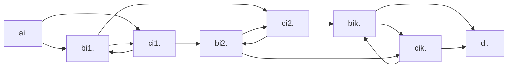
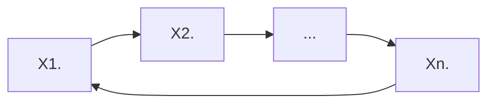

# теория сложности

> **literature:**
>
> *   Arora Barak "Complexity Modern Approach" (1st part)
> *   Garry Johnson "Трудно разрешенные задачи"
> *   site: compendium of NP-complete problems
>
> **outline:**
>
> *   [NP-полнота](#np-complexity)
>     *   [Концепция недетерминированных вычислений](#conception)
> *   [Сведения](#conversion)
>     *   [Теорема Кука-Левина](#thkl)
> *   [язык CNFSAT](#cnfsat)
>     *   [Теорема $CNFSAT \in NPC$ ](#cnfsatinnpc)
>     *   [Теорема $CNFSAT \to 3SAT$ ](#cnfsatto3sat)
> *   [Теорема $IND \in NPC$](#indinnpc)
> *   [диагональный метод](#diagonal)
>     *   [теоремы об иерархии](#hierarchy)
>         *   [Теорема о ёмкости иерархии](#thvh)
>         *   [Теорема о временной иерархии](#thth)
>     *   [Теорема Бэйкера-Гилла-Соловэя (BGS)](#bgs)
>     *   [Теорема Ладнера](#ladner)
> *   [coNP](#coNP)
> *   [PSPACE и PSPACE полнота](#PS)
>     *   [$TQBF \in PSC$](#TQBF)
>     *   [Теорема $NSPACE(f(n)) \subset DSPACE(f(n)^2)$](#nspace)
>         *   [Следствие. Теорема Сэвитча](#savitch)

## <a name="np-complexity">NP-полнота</a>

Характеристики сложности вычисления.
Есть распознователи ($\Sigma^* \rightarrow B$) и преобразователи ($\Sigma^* \rightarrow \Sigma^*$)

+ время: $T(n) = O(f(n))$
+ память: $S(n)$
+ random: $R(n)$

$DTIME(f) = \{L\ |\  \exists\ program\ p : \\ 1. \ x \in L \implies p(X) = 1, x \notin L \implies p(x) = 0 \\ 2.\ n = |x| \implies T(p, x) = O(f(n))\}$

$h = (01)^* \in DTIME(n)$

$\widetilde{DTIME(f)} = \{h\ |\ ...\}$

палинромы: $Pal \in DTIME_{RAM}(n)\\ Pal \notin DTIME_{TM}(n)$

$P = \cup_{f - polynom} DTIME(f) = \cup^\infty_{i = 0} DTIME(n^i)$

$p(n) q(n): p + q, p * q, p(q(n))$
$L_1 L_2 \in P:  L_1 \cup L_2 \in P, L_1 \cap L_2 \in P, \overline{L_1} \in P, L_1 L_2 \in P, L_1^* \in P$

### <a name="conception">концепция недетрминированных вычислений</a>

Допускается $\iff \ \exist$ последовательность переходов, которая приводит к допуску
недетерминировання программа p(x) допускает $\iff \ \exist$ последовательность недетерминированных выборов, приводящая к допуску
p(x) не допускает $\iff \ \forall$ последовательности выборов не допуск

**def** ==*NTIME(f)*== = $\{L \ | \ \exist$ недетерминированная программа  p $1) \ p(x) - acc \iff x \in L; \ 2) \ T(p, x) = O(f(n))\}$

>   **ex** задача о гамильтоновом цикле
> ```
> p(G)
>     vis[1..n]: arr of bool
>     s = 1
>     for i = 1..n
>         u = ?{1..n}
>         if (vis[u]) return false
>         if (su not in EG) return false
>         vis[u] = true
>         s = u
>     if (s != 1) return false
>     return true
> ```


> **ex** `isComposite(z)`, $n = \lceil \log_B z \rceil$, где B - это основание системы счисления
>
> ```
> a = ?{2..z-1} // T = logn
> if z % a = 0  // poly(logn)
>     return true
> return false
> ```

Нельзя свопнуть бранчи и сделать проверку на простоту, потому что это `true` и `false` не симметричны в недетерминированных вычислениях (нельзя даже `isPrime(n): return !isComposite(n)`)

---

**def** ==*NP*== = $\cup_{f - polynome}\ NTIME(f)$, *nondeterministic polynomial*
**stat** $P \sub NP$

**?** $P = NP$

*неформально*: класс P - класс задач, которые можно решить за полином, класс NP - класс задач, решение которых можно проверить за полином

$\Sigma_1$ - класс языков, в которых можно формализовать класс решения, которое можно проверить за полином
$\Sigma_1 = \{L \ | \ \exist$ полином p, работающая за полином программа R(x, y) - детерминированная
$x \in L \iff \exist \ y $ (называют *сертификат*)$: \ |y| \leq p(|x|) \ and\  R(x, y) = 1$
$x \notin L \implies \forall \ y\ (|y| \leq p(|x|)) \ R(x, y) = 0 \}$

> **ex** гамильтонов цикл $Ham \in \Sigma_1$
> ```
> R(G, y):
>     y as arr[1..n] of int
>     // we can add: y = ?arr[i..n] of {1..n} // O(n)
>     vis = arr[1..n] of bool
>     for i = 1..n
>         if (y[i] y[i mod n+1] not in EG) return false
>         if vis[y[i]] return false
>         vis[y[i]] = true
>     return true
> ```

---

**Th** $NP = \Sigma_1$
$L \in NP$, $L \in \Sigma_1$
*неформально*: NP – определение на языке недетерминированных формат, $\Sigma_1$ – определение на языке сертификатов

---

## <a name="conversion">сведения</a>

**def** ==сводим B к A *по Тьюрингу*==:  А, B – языки, C – сложностный класс, $B \in C^A$ (C  с *оракулом* A). не считая вызова функции `isInA(x): Bool`, остальные ограничения класса C учитываются.

**def** ==сведение по *Куку-Левину*== *(Тьюрингу за полином)* $B \in P^A$

**def**<a name="Karp"> </a>==*сведене по Карпу*== *(m-сведение)*: язык B сводится к A ($B \leq A$), если $\exist$ вычислимая за полином функция f такая, что $x \in B \iff f(x) \in A$

>   **ex** $IND = \{\langle G, k \rangle  |$ $ в $ $\ G \ d$ независимое множество размера k $\}$
>   $CLIQUE = \{\langle G, k \rangle  |$ в $ G \exist$ клика размера k$\}$
>   $IND \leq CLIQUE$
>   $f(\langle G, k \rangle ) = \langle \overline{G}, k \rangle $ // за полином
>   в G и множестве размера k $\iff$ в $\overline{G} \ \exist$ клика размера k
>   $VCOVER = \{\langle G, k \rangle  |$ в $G \ \exist$ вершинное покрытие размера  $k\ \}$
>   $IND \leq VCOVER$
>   $f(\langle G, k \rangle ) = \langle G, n - k \rangle $, где n - число вершин G

>   **ex** $SUBSETSUM = \{\langle [x_1, x_2, ..., x_n], s \rangle \ | \ \exist I \subset \{1,2, ..., n\}, \sum_{i \in I} = s, x_i \in \N\}$
>   `dp[i][w]` - можно ли первые i $\Sigma = w$ // w - $2^{|s|}$
>   $VCOVER \leq SUBSETSUM$
>   пронумеруем вершины с единицы, рёбра – с нуля, битовыми масками каждой вершине сопоставляем рёбра
>
>   ```mermaid
>   graph LR;
>       1 --1--- 2
>       2 --2--- 3
>       3 --3--- 5
>       3 --4--- 4
>       4 --5--- 5
>       5 --0--- 1
>   ```
>
>   |       | 6    | 5    | 4    | 3    | 2    | 1    | 0    |
>   | ----- | ---- | ---- | ---- | ---- | ---- | ---- | ---- |
>   | $x_1$ | 1    | 0    | 0    | 0    | 0    | 1    | 1    |
>   | $x_2$ | 1    | 0    | 0    | 0    | 1    | 1    | 0    |
>   | $x_3$ | 1    | 0    | 1    | 1    | 1    | 0    | 0    |
>   | $x_4$ | 1    | 1    | 1    | 0    | 0    | 0    | 0    |
>   | $x_5$ | 1    | 1    | 0    | 1    | 0    | 0    | 1    |
>   | s     | 3    | 2    | 2    | 2    | 2    | 2    | 2    |
>
>   $x_6 = 1\\ x_7 = 10 \\ x_8 = 100 \\ x_9 = 1000 \\ x_{10} = 10000 \\ x_{11} = 100000$
>   $f(\langle G, k \rangle)$, n - число вершин, m - число рёбер, $s = k22...2$, m двоек
>
>   f сводит VCOVER к SUBSETSUM
>   $\Rightarrow$: в G $\exist$ вершинное погрытие размера k
>   $\Leftarrow$: $[x_1 ..., x_{n + n}], s \ \exist$ решение $\Rightarrow$ в $G \ \exist$ вершинное покрытие размера k

**def** язык называется ==*NP-hard*== (*NP-трудный*), если выполнены следующие условия:
       $\forall B \in NP: B \leq A$
**def** A называется ==*NP-complete*== (*NP-полный*), если:
       1) $A \in NPH$
       2) $A \in NP$
       // $NPC = NPH \cap NP$

>   **ex** $BH_{1N}$ (bounded halting unary nondeterministic)
>   $BH_{1N} = \{\angle m, x, 1^t \rangle \ | $ m – недетрминировання машина тьюринга, x – вход, t – ограничение времени: $\exist$ последоватеьность недетерминировання выборов машины Тьюринга m, что она допускается за t шагов: `m(x) = 1`$\}$
>
>   **Th** $BH_{1N} \leq NPC$
>
>   1.  $BH_{1N} \in NPH$
>        $A \in NP$
>        // [def по Карпу](#Karp)
>        $m_A$ - недетерминировання машина Тьюринга, решающая A за полином $p(n) = c n^k$
>        $f(x) = \langle m_A, x, q^{p(|x|)} \rangle$
>        $x \in A \iff \exist$ последовательность выборов $m_A(x) = 1$ (за $p(|x|)$)
>   2.  $BH_{1N} \in NP$

**L** $A \leqslant^k B, B \leqslant^k C \implies A \leqslant^k C$
$x \stackrel{t}\rightarrow f(x) \stackrel{t}\rightarrow g(f(x))$
**con** $A \in NPH, A \leqslant B \implies B \in NPH$

**stat** если $B \leqslant A$, $A \in NPH$
$NP \stackrel{t}\rightarrow BH_{1N} \stackrel{t}\rightarrow SAT$

**def** ==$SAT$== $= \{\phi(x_q...x_n) \ | \ \exist x_1...x_n \ \phi(x_1...x_n) = 1, \phi - бф\}$


### <a name="thkl">**Th** *(Кук, Левин)* SAT in NPC</a>

$SAT \in NPC$

$BH_{1N} \leqslant SAT$
$\langle m, x, 1^t \rangle \ \stackrel{f}\mapsto \phi$

$\phi$ удовлетворяет $\iff \ \exist$ последовательность недетерминированных выборов $m(x) = 1$, за время t

больше t шагов не будет, есть мгновенные описания машины $\alpha\#_q\beta$
дополним описания до длины t + 1
$q_0\vdash q_1\vdash...\vdash q_t$

*табло вычислений*: первая строка - стартовое состояние, $i \rightarrow i + 1, q_i \vdash q_{i + 1}$, допуск: последовательность до $\#_{acc}$

$\langle m, x, 1^t \rangle  \ \in BH_{1N} \iff \exist$ допускающее табло вычислений


количество состояний $|Q| = z$, множество ленточного алфавита $|PT| = y$, $z + y = k$
заведём $(t + 1)^2 k$ переменных, $x_{ijc}$ – верно ли, что в табло в i-й j-й ячейке записан символ 'c'

$\phi(x_{ijc}) = C \and S \and T \and N$

$C = \and{i, j = 0..t} \or_C ((\and \neg X_{ij\alpha}) \and X_{ijc})$

$S = X_{00\#_s} \and X_{01x_1} \and X_{02x_2} \and ... \and X_{0nx_n} \and X_{0(n+1)B} \and ...$

$T = X_{t0\#x} \or X_{t1\#_y} \or ... \or X_{tt\#_y}$

$N = (\and_{i, j} \and_{c_1 c_2 c_3 c_3 \notin Q} X_{i - 1, j -1, c_1} \and X_{i -1 , j, c_2} \and X_{i, j +1 , c_3} \and X_{i, j, c_4} \rightarrow c_1 = c_4) \and_{ijx} \and_{c_1...c_6...}$ допустимы

$qed \ \square$

---

## <a name="cnfsat">язык CNFSAT</a>

**def** ==$CNFSAT$== $= \{\phi \ | \phi$ в КНФ$, \phi \in SAT\}$
$(x_i\or \neg  \ x_j ...) \and  (\or\or\or) \and (\or)$
*clause* (клоз)
**ex** 2-SAT (ровно две) HornSAT (не более одной без отрицания)

### <a name = "cnfsatinnpc">Th CNFSAT in NPC</a>

1.  $CNFSAT \in NP$
2.  $CNFSAT \in NPH$
    $SAT \leqslant CNFSAT$
    $\phi \stackrel {f\ \ (polynomial\ time)} \longrightarrow \psi$
    $\phi \in SAT \iff \psi = f(\psi) \in CNFSAT$

базис: $\and, \or, \neg$

строим дерево разбора нашей формулы $\phi$:

*   если у neg сын neg, то можем удалить
*   neg -> and/or => neg <- and/or -> neg neg

каждому поддереву соответствует преобразованная подформула $\phi_i(x_{i_1} ... x_{i_k})$ , хотим построить следующее: $\psi_i(x_{i_1} ... x_{i_k}, y_1 ... y_{i_t})$
$\phi(\overline X) = 1 \implies \exist \overline y \psi(\overline x, \overline y) = 1$
$\phi(\overline X) = 0 \implies \forall \overline y \psi(\overline x, \overline y) = 0$

| вершина | brand new $\psi$                                             |
| ------- | ------------------------------------------------------------ |
| X       | $\phi = X, \psi = X$                                         |
| neg X   | $\phi = \neg X, \psi = \neg X$                               |
| and     | $\phi_1 \and \phi_2, \psi_1 \and \psi_2$                     |
| or      | $\psi_1 \or \psi_2$ не можем написать, потому что это не будет в КНФ <br />новая переменная z: <br />$(\psi_1 \or z) \and (\psi_2 \or \neg z)$ |

>   получается, что число клозов равно числу листьев
>   внутри каждого клоза число вхождений равно число переменных + или

#clauses = #leaves
#entries = #vars + #or
poly

$\square\ qed$

### <a name="cnfsatto3sat">Th CNFSAT to 3SAT</a>

>   $3SAT =CNFSAT \and 3CNF$

1.  $3SAT \in NP$
2.  $3SAT \in NPH$
    $CNFSAT \leqslant 3SAT$

| $\psi$                                                       | $X$                                  |
| ------------------------------------------------------------ | ------------------------------------ |
| $(x \or y \or u) \and (x \or y \or \neg u)$                  | $x \or y$                            |
| ok                                                           | $x \or y \or z$                      |
| вспомогательные переменные<br />k - 3 новые перменные:<br />$(x_1 \or x_2 \or t_1) \and (\neg t_1 \or x_3 \or t_2) \and (\neg t_2 \or x_2 \or t_3) \and ... \and (\neg t_{k - 3} \or x_{k - 1} \or x_k)$ | $x_1 \or x_2 \or ... \or x_k, k > 3$ |

$\square \ qed$

3SAT - superstar

## <a name="indinnpc">Th IND in NPC</a>

дана формула $\phi$ в 3КНФ, мы хотим вывести граф G и число k, такие что $\phi$ удовлетворима тогда и только тогда, когда в графе есть независимое множество размера k
$\phi \in 3SAT \iff \langle G, k \rangle \in IND$

в $\phi$ k clauses, граф построим из k triangles
в вершинах переменные, соответствующие claus'ам
соединим переменные с их отрицанием

---

$HAM = \{G \ | \ G -$ ориентированный граф, содержит Гамильтонов цикл$\}$
$HAM\in NP$
$HAM \in NPH$

$\phi (x_1 x_2 ... x_n)$ k clauses
$x_i \rightarrow 2k + 2$ вершины





где X - это компонента предыдущего вида

---

## <a name="diagonal">диагональный метод</a>

### <a name="hierarchy">теоремы об иерахии</a>

$DSPACE(f) = \{L \ | \ \exist$ программа p: $x \in L \implies p(x) = 1 \\ x \notin L \implies p(x) = 0$ $ S(p, x) = O(f(n))\}$
$PSACE = \cup_{p - polynom} DSPACE(p)$

**Th NP subset PS subset EXP**

**thesis** если p запускает q, q использует $O(f)$ памяти, то p может тоже для этого использовать$ O(f)$ памяти

#### <a name="thvh">Th о ёмкости иерархии</a>

${f \over g} \to 0$ тогда $\exist L: L \in DSPACE(g)\backslash DSPACE(f)$

$h = \sqrt{fg}, \ \ {h \over g} \to 0, \ \ {f \over h} \to 0$

$n = |\langle p, x\rangle|$

$L = \{\langle p, x \rangle  \ | \ $неверно, что $(p(\langle p, x \rangle ) = 1, $ использовав $h(n)$ памяти $)\}$

$L \in DSPACE(g)$

Пусть $L \notin DSPACE(f)$, q - разрешает L, используя $\leqslant c f(n)$, рассмотрим $n_0: h(n_0) > cf(n_0)$, $n_0 > |q|$

рассмотрим $x: |\langle q, x \rangle | = n_0$

$q(\langle q, x \rangle ) = \  ?$

$q(\langle q, x \rangle) = q \implies \langle q, x \rangle \in L \implies !(q(\langle q, x \rangle) = 1 \ and \ S(q, \langle q, x \rangle) \leqslant cf(n) \langle  h(n_0)) \implies q(\langle q, x \rangle) = 0$

$q(\langle q,x \rangle) = 0 \implies \langle q, x \rangle \notin L \implies q(\langle q, x \rangle) = 1$


#### <a name="thth">Th о временной иерархии</a>

DSPACE -> DTIME, память -> время

ломается немного первая часть, так что новое условие:

${f \over g} \to 0, \exist h: {f \over h} \to 0, {sim(h) \over g} \to 0. \ \  (sim(h) = O(g))$ (где $sim(f)$ - за сколько можно просимулировать программу, работающую за f) тогда $\exist L: L \in DTIME(g)\backslash DTIME(f)$

$h = \sqrt{fg}, \ \ {h \over g} \to 0, \ \ {f \over h} \to 0$

$n = |\langle p, x \rangle|$

$L = \{l\angle p, x \rangle \ | \ $неверно, что $(p(\langle p, x \rangle) = 1, $ использовав $h(n)$ времени $)\}$

$L \in DTIME(g)$

Пусть $L \notin DTIME(f)$, q - разрешает L, используя $\leqslant c f(n)$, рассмотрим $n_0: h(n_0) > cf(n_0)$, $n_0 > |q|$

рассмотрим $x: |\langle q, x \rangle| = n_0$


> **Implies** $P \neq EXP$
>
> $f = n^{\log_2 n} = 2^{(\log_2 n)^2}$
> $g = 2^n$
> ${f \over g} \to 0 \implies \exist L \in DTIME(g) \backslash DTIME(f)$ (первая часть $\implies L \in EXP$, вторая – $\implies L \notin P$)


### <a name="bgs">Th (Бейкер, Гилл, Соловэй) BGS</a>

$u = \{\langle p, x \rangle |\ \ p(x) = 1\}$
$uni(p, x) \to$ останавливается ли p на x

Вычисления с оракулом $p^A$ – p  с оракулом A

$\exist$ оракул $A: p^A = NP^A$
$\exist$ оракул $B: p^B \neq NP^B$

// **релятивизуется**, если доказательство остаётся верным, если всему фиксированному в программе добавить оракул

рассмотрим $A \in PSC$

$p^A \stackrel{1}\subset NP^A \stackrel{2}\subset PS^A \stackrel{3}\subset PS \stackrel{4}\subset P^A$:

1.  любая недетерминировання программа частный случай детерминированной
2.  релятивизуется
3.  можем заменить вызов оракула на процедуру проверки
4.  потому что взяли PSpace полный, любой сводится за полином и спросим у оракула

B   $U_B = \{x \ | \ \exist y \in B\ \ \  |x| = |y|\}$

**L** $\forall B \ \ U_b \in NP^B$

Придумаем $B: U_B \notin P^B$

---

Теперь рассмотрим часть $\exist$ оракул $B : p^B \neq NP^B$:

Построим последовательность программ $q_1, q_2, q_3, ...$
$T(q_i)$ - полином
$\forall L \in P : \exist i: q_i$ разрешает $L$

Рассмотрим все коды исходных программ, упорядочим их лексикографически и запустим

// n – это длина входа

|       | $n$  | $2 n^2$ | $3n^3$ | …    | $kn^k$               | …    |
| ----- | ---- | ------- | ------ | ---- | -------------------- | ---- |
| $p_1$ |      |         |        |      |                      |      |
| $p_2$ |      |         |        |      |                      |      |
| …     |      |         |        |      |                      |      |
| $p_m$ |      |         |        |      | $p_m \ | \ TL= kn^k$ |      |
| …     |      |         |        |      |                      |      |

каждая из этих программ работает за полином

нумеруем эту табличку по диагонали

получим счётное множество пронумерованных программ

если программа не успела завершиться за TL, то говорим, что $q_i$ возвращает 0

---------

так же можем занумировать все программы с оракулами: $q_1^\bullet, q_2^\bullet, ..., q_n^\bullet, ...$

должны сделать $B : p^B \neq NP^B$

рассмотрим $B: U_B = \{x \ |\ \exist y : |x| = |y|, y \in B\}$

**L** $\forall B: U_B \in NP^B$

>   ```
>   ub(x)
>       y <- недетерминированно Sigma^|x|
>       return check(y) 
>   ```

Построить $B: U_B \notin p^B$ (если построим такое B, то теорема БГС доказана)

$B_1: q_1^{B_1}$ не распознавала $U_{B_1}$

запустим $q_1$ с оракулом и будем выступать в роли оракула

$q_1^\bullet(x_1)$ : спрашивает оракула $?y_1 \rightarrow NO$ (пишем в map наши ответы) $?y_2 \rightarrow NO \  ... \ ?y_k \rightarrow NO$

// выберем $x_`: T(q_1, x_1) < 2^{|x_1|}$

если результат программы $YES: \ \forall z \ |z| = |x_1|: z \notin B_1$
$NO: \ \exist z_1: q_1^\bullet(x_1)$ не задала вопрос про $z_1, \ |z_1| = |x_1|; \ z_1 \in B_1$

$B_1 \rightarrow B_2 \ q_1^{B_2}$ не распознаёт $U_{B_2}, q_2^{B_2}$ не распознаёт $U_{B_2}$
$T(q_2^\bullet, x_2) < 2^{|x_2|}, |x_2| > $ максимальной длины, для которого известно принадлежность $B_1$

теперь запускаем $q_2(x_2)$: спрашивает у нас: если спрашивали уже про это слово, то я то же самое и отвечаю, если нет, отвечаю $NO$ и записываю 

$B_k \ \forall i \leqslant k : q_i^{B_k}$ не распознаёт $U_{B_k}$

опять находим $x_k$ и запускаем

тот же самый подход, что и выше, при запуске

этот процесс продолжается до бесконечности

для ответа БГС возьмём ==$B = \cup^\infty_{k = 1} B_k$==


// релятивизация – это *барьер* доказательства $P \neq NP$


### <a name="ladner">Th *Ладнера*</a>

$P \neq NP \implies \exist L: L \notin P, L \notin NPC, L \in NP$

>   иллюстрация, **не** доказательство
>
>   *Blowing Holes in SAT*
>
>   координатная ось с итерированным логарифмом
>
>   $1 \rightarrow 10 \rightarrow 10^{10} \rightarrow 10^{10^{10}}$
>
>   выбираем нечётные промежутки
>
>   $SAT0 = SAT \ \cap\ EVEN$
>
>   $EVEN = \{x \ | \ log^*_{10}|x|$ чётен $\}$
>
>   к нему сводится $SAT$:
>
>   $\exist f : x \in SAT \iff f(x) \in SAT0$
>

так же, как в теореме БГС, у нас есть последовательность $q_1, q_2, ..., q_n, ...$ , так же запускаем программу $p_i$ с таймером $jn^j$  и так же занумеровали программу по диагонали: $f_1 ... f_i ...$

все $f_i$  работают за полином 

$L = SAT \ \cap \ EVEN\ (SAT \ \cap \ \{\phi \ | \ |\phi|$ в "чёрном" куске $\})$ 

рассмотрели первый чёрный кусок, префикса которого достаточно, чтобы программа $q_1$ не разрешала $L$ за полином

теперь рассмотрим некст белый кусок: добъёмся того, чтобы сведение $f_1$ неправильно сводило $SAT$ к нашему языку

занумеруем формулы по возрастанию длины и дальше лексикографически: $\phi_1, \phi_2, ...$

$\phi_1 \stackrel{f_1} \rightarrow z_1 \\ \phi_2 \rightarrow z_2\\...$

найдётся формула $\phi_x \stackrel{f_1} \rightarrow z_x: \phi_x \in SAT \neq z_x = f_1(\phi_x) \in L$

найдётся такая $\phi_x$ потому, что  если бы не нашлось, то получили бы противоречие в том, что $SAT$ сводится за полиномальное время под действием $f_1$ к конечному языку

$z_x$ лежит либо в первом чёрном отрезке, либо во втором белом
$n_2 = max(n_1 + 1, |z_x|)$

> **Lemma** $L \in NPC, F -$ конечный, $L \setminus F \in NPC$
> $L \leqslant L \setminus F$
>
> ```
> f(x):
>        if x in F
>            if x in L return YesWord
>            else return NoWord
>        else retun x
> ```

построим $BLACK$:

1.  $x \in BLACK$ – зависит только ок $|X|$
2.  $BLACK \in P$
3.  $L \notin NPC, L \notin P$

разрешитель $BLACK$: (верно ли, что слова длины $n$ принадлежат нашему языку, пусть работает за n)

```
black(x: String)
    a = black(|x|)
    return x in BLACK // основываясь на данных из массива a

black(n): List<Int> 
// [n1, n2, ..., nk] - список всех границ, которые не превышают n
// ограничение по времени n^(большое число, пусть 100)
    if n = 0 return []
    a = black(n - 1)
    // black(n - 1) отработала за T <= (n - 1)^100, T_left >= n^99
    set Timer on n^99, if triggered return a
    if len(a) чётна:
        i = len(a) / 2 + 1
        for (phi - формула, |phi| <= n):
            if (phi in SAT intersect BLACK != q_i(phi))
                return a ++ [n]
    else // len(a) нечётна
        i = (len(a) - 1) / 2 + 1
        for (phi - формула, |f_i(phi)| <= n):
            if (phi in SAT != f_i(phi) in SAT intersect BLACK):
                return a ++ [n]
    return a
```

---------

## <a name="coNP">coNP</a>

**def** ==$coNP$== $= L \ | \ \overline L \in NP$

>**ex** $SAT \in NP,\\ \overline{SAT} \in coNP$
>
>есть все слова $\Sigma^*$, среди них есть булевы формулы и давайте рассматривать только булевы формулы, они делятся на $SAT$ и на $\overline {SAT}$ , а на небулевы формулы забьём
>
>$\overline{SAT} = \{\phi \ | \ \forall \stackrel \rightarrow x: \phi(\stackrel \rightarrow x ) = 0\} $

>**ex** $FACTORIZATION = \{\langle n, x \rangle \ |$ у  $n \ \exist$ простой делитель $\leqslant x \} \in NP \cap coNP$
>
>(P candidate)


## <a name ="PS">PSpace и PSpace полнота</a>

**def** ==$PS$== $= \cup_{p - polynom} DSPACE(p)$

$P \subset NP \subset PS \subset EXP$

**def** $L \in$ ==$PSH$== : $\forall A \in PS: \ A \leqslant L \  (f  \ - $ за полином $x \in A \iff f(x) \in L)$

**def** $L \in$ ==$PSC$==: $1) \ L \in PSH \\ 2) L \in PS $

>   **ex** булевы формулы с квантора (матлог референс)
>   $TQBF$ (True Quantified Boolean Formula) $= \{\phi \ | \ \phi \ - $ булева формула с кванторами, $Free(\phi) = \empty \ \ val(\phi) = 1\}$

### <a name="TQBF">TQBF in PSC</a>

1.  $TQBF \in PS$
    построим дерево разбора и храним множество значений текущих свободных переменных

2.  $TQBF \in PSH$ 
    рассмотрим $L \in PS, \ L \leqslant TQBF$
    m - машина Тьюринга, разрешающая L, детерминировання, $S(m, x) \leqslant p(n) \ $//$ \ n = |x|$

    $m(x) \ \ q_o \vdash q_1 \vdash q_2 \vdash ... \vdash q_t$

    $f : x \rightarrow \phi$

    $\phi \ -$ истина $\iff m(x) = 1$

    $X_{ijc} \ -$ ячейка $(i, j)$ содержит символ $c$

    $Q_i = [X_{i0c_1}, X_{i1c_1}, ..., X_{ip(n)c_1}, X_{i0c_2}, ..., X_{ip(n)c_2}]$

    $S(Q_0) \ \cap \ T(Q_t) \ \cap \ C \ \cap \ N$

    введём синтаскический сахар: $\exist (\forall) Q_i := \exist (\forall) X_{i0c_1} , \exist (\forall) ...$

    $Q_i \vdash Q_{i + 1}$

    $\exist Q_0 \ \exist Q_1 \ .. \exist Q_t \ S(Q_0) \ \and \ T(Q_t) \ \and \ C \ \and \ Q_0 \vdash Q_1 \ \and\  Q_1 \vdash Q_2 \ \and\  ... \ \and\  Q_{t - 1} \vdash Q_t$

    выведенная формула плоха её длиной: $Q(Q_0), \ T(Q_t), \ Q_0 \vdash Q_1$ имеют длину $p(n)$, но последних кусков $t$, таким образом вся формула имеет длину $p(n) 2^{q(n)}$,  а это не полиномиальное сведение

    $Q \vdash R$

    $\vdash \ -$ булева формула от $2 \ (p(n) + 1) \ z$ аргументов

    $Q \vdash R := Q \underbrace{\vdash U_1 \vdash U_2  ... \vdash U_{2^{m} - 1} \vdash R}_{2^m}$

    $\vdash_m = \vdash^{2^m}$

    $Q \vdash_m R = \exist \ T \ (Q \vdash_{m - 1} T \ \and \ T \vdash_{m - 1} R)$

    $Q \vdash_m R = \exist \ T \ \forall A \ \forall B \ (\neg (A \vdash_{m - 1} B) \rightarrow (Q \neq A \or B \neq T) \and (T \neq A \or B \neq R))$

    $len(m) = O(p(n)) + len(m - 1) \implies len(m) = O(p(n)  \ m)$

$\square$

---------

// PS proof template: $PS \rightarrow TQBF \rightarrow L$


### <a name="nspace">Th NSPACE(f(n)) subset DSPACE(f(n)^2^)</a>

$f(n) \geqslant log(n)$
$NSPACE(f(n)) \subset DSPACE(f(n)^2)$

*Доказательство*:

Пусть $L \in NSPACE(f(n))$ $\exist$ недетерминирванная машина Тьюринга $x \in L \iff \exist$ последовательность недетерминированных выборов, m(x) = 1
$S(m, x) \leqslant f(n), \  n = len(x)$

вход — лента машины Тьюринга со словом $x$
рабочая — лента машины Тьюринга с $f(n)$ 
конфигурация машины Тьбринга кодируется:$ (pos, work)$, где $work = \alpha \#_p \beta$, длина $pos = log(n)$ , а длина $work = f(n) + 1$, и тогда вся длина пары — $O(f(n))$

Существует ли последовательность переходов длиной $2^{c \ f(n)}$, которая $q_0$ переводит в допускающую конфигурацию $q_t$

заведём функцию (можно ли достичь): $Reach(q_s, q_t, k)$ (можно ли из $q_s$ перейти за $2^k$ шагов до $q_t$ ($q_s \vdash^{2^k} q_t$))

```
Reach(qs, qt, k):
    if (k = 0):
        return qs |- qt
    for (qm - конфигурация машины Тьюринга m):
        if Reach(qs, qm, k - 1) and Reach (qm, qt, k - 1):
            return True
    return False
```

локальные переменные функции `Reach` занимают $f(n)$, суммарно памяти нам понадобится $O(k \ f(n))$

```
inL(x):
    qs - стартовая конфигурация m
    for (qt - допускающая конфиграция m):
        if Reach(qs, qt, c * f(|x|)):
            return 1
    return 0
```

$q_s$ требует $f(n)$ памяти
вызов `Reach` требует $f(n)^2$ памяти
локальная переменная $q_t$ требует $f(n)$ памяти


#### <a name="savitch">Следствие Th (*Сэвитча*)</a>

$PS = NPS$
