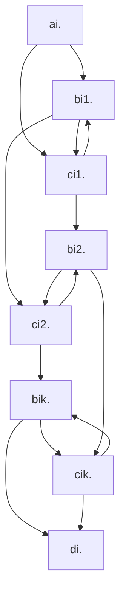
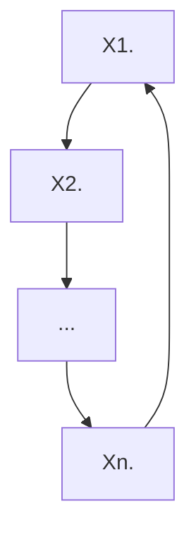

# теория сложности

> **literature:** 
>
> *   Arora Barak "Complexity Modern Approach" (1st part)
> *   Garry Johnson "Трудно разрешенные задачи"
> *   site: compendium of NP-complete problems
>
> **outline:**
>
> *   [NP-полнота](#np-complexity)
>     *   [Концепция недетрминированных вычислений](#conception)
> *   [Сведения](#conversion)
>     *   [Теорема Кука-Левина](#thkl)
> *   [язык CNFSAT](#cnfsat)
>     *   [Теорема $CNFSAT \in NPC$ ](#cnfsatinnpc)
>     *   [Теорема $CNFSAT \to 3SAT$ ](#cnfsatto3sat)
> *   [Теорема $IND \in NPC$](#indinnpc)

## <a name="np-complexity">NP-полнота</a>

Характеристики сложности вычисления.
Есть распознователи ($\Sigma^* \rightarrow B$) и преобразователи ($\Sigma^* \rightarrow \Sigma^*$)

+ время: $T(n) = O(f(n))$
+ память: $S(n)$
+ random: $R(n)$

$DTIME(f) = \{L\ |\  \exists\ program\ p : \\ 1. \ x \in L \implies p(X) = 1, x \notin L \implies p(x) = 0 \\ 2.\ n = |x| \implies T(p, x) = O(f(n))\}$

$h = (01)^* \in DTIME(n)$

$\widetilde{DTIME(f)} = \{h\ |\ ...\}$

палинромы: $Pal \in DTIME_{RAM}(n)\\ Pal \notin DTIME_{TM}(n)$

$P = \cup_{f - polynom} DTIME(f) = \cup^\infty_{i = 0} DTIME(n^i)$

$p(n) q(n): p + q, p * q, p(q(n))$
$L_1 L_2 \in P:  L_1 \cup L_2 \in P, L_1 \cap L_2 \in P, \overline{L_1} \in P, L_1 L_2 \in P, L_1^* \in P$

### <a name="conception">концепция недетрминированных вычислений</a>

Допускается $\iff \ \exist$ последовательность переходов, которая приводит к допуску
недетерминировання программа p(x) допускает $\iff \ \exist$ последовательность недетерминированных выборов, приводящая к допуску
p(x) не допускает $\iff \ \forall$ последовательности выборов не допуск

**def** *NTIME(f)* = $\{L \ | \ \exist$ недетерминированная программа  p $1) \ p(x) - acc \iff x \in L; \ 2) \ T(p, x) = O(f(n))\}$

>   **ex** задача о гамильтоновом цикле
> ```
> p(G)
>     vis[1..n]: arr of bool
>     s = 1
>     for i = 1..n
>         u = ?{1..n}
>         if (vis[u]) return false
>         if (su not in EG) return false
>         vis[u] = true
>         s = u
>     if (s != 1) return false
>     return true
> ```


> **ex** `isComposite(z)`, $n = \lceil \log_B z \rceil$, где B - это основание системы счисления
>
> ```
> a = ?{2..z-1} // T = logn
> if z % a = 0  // poly(logn)
>     return true
> return false
> ```

Нельзя свопнуть бранчи и сделать проверку на простоту, потому что это `true` и `false` не симметричны в недетерминированных вычислениях (нельзя даже `isPrime(n): return !isComposite(n)`)

---

**def** *NP* = $\cup_{f - polynome}\ NTIME(f)$, nondeterministic polynomial
**stat** $P \sub NP$

**?** $P = NP$

*неформально*: класс P - класс задач, которые можно решить за полином, класс NP - класс задач, решение которых можно проверить за полином

$\Sigma_1$ - класс языков, в которых можно формализовать класс решения, которое можно проверить за полином
$\Sigma_1 = \{L \ | \ \exist$ полином p, работающая за полином программа R(x, y) - детерминированная
$x \in L \iff \exist \ y $ (называют *сертификат*)$: \ |y| \leq p(|x|) \ and\  R(x, y) = 1$
$x \notin L \implies \forall \ y\ (|y| \leq p(|x|)) \ R(x, y) = 0 \}$

> **ex** гамильтонов цикл $Ham \in \Sigma_1$
> ```
> R(G, y):
>     y as arr[1..n] of int
>     // we can add: y = ?arr[i..n] of {1..n} // O(n)
>     vis = arr[1..n] of bool
>     for i = 1..n
>         if (y[i] y[i mod n+1] not in EG) return false
>         if vis[y[i]] return false
>         vis[y[i]] = true
>     return true
> ```

---

**Th** $NP = \Sigma_1$
$L \in NP$, $L \in \Sigma_1$
*неформально*: NP – определение на языке недетерминированных формат, $\Sigma_1$ – определение на языке сертификатов

---

## <a name="conversion">сведения</a>

**def** сводим B к A *по Тьюрингу*:  А, B – языки, C – сложностный класс, $B \in C^A$ (C  с *оракулом* A). не считая вызова функции `isInA(x): Bool`, остальные ограничения класса C учитываются.

**def** сведение по *Куку-Левину (Тьюрингу за полином)* $B \in P^A$

**def**<a name="Karp"> </a>*сведене по Карпу (m-сведение)*: язык B сводится к A ($B \leq A$), если $\exist$ вычислимая за полином функция f такая, что $x \in B \iff f(x) \in A$

>   **ex** $IND = \{<G, k> |$ $ в $ $\ G \ d$ независимое множество размера k $\}$
>   $CLIQUE = \{<G, k> |$ в $ G \exist$ клика размера k$\}$ 
>   $IND \leq CLIQUE$
>   $f(<G, k>) = <\overline{G}, k>$ // за полином
>   в G и множестве размера k $\iff$ в $\overline{G} \ \exist$ клика размера k
>   $VCOVER = \{<G, k> |$ в $G \ \exist$ вершинное покрытие размера  $k\ \}$
>   $IND \leq VCOVER$
>   $f(<G, k>) = <G, n - k>$, где n - число вершин G

>   **ex** $SUBSETSUM = \{<[x_1, x_2, ..., x_n], s>\ | \ \exist I \subset \{1,2, ..., n\}, \sum_{i \in I} = s, x_i \in \N\}$
>   `dp[i][w]` - можно ли первые i $\Sigma = w$ // w - $2^{|s|}$
>   $VCOVER \leq SUBSETSUM$
>   пронумеруем вершины с единицы, рёбра – с нуля, битовыми масками каждой вершине сопоставляем рёбра
>
>   ```mermaid
>   graph LR;
>       1 --1--- 2
>       2 --2--- 3
>       3 --3--- 5
>       3 --4--- 4
>       4 --5--- 5
>       5 --0--- 1
>   ```
>
>   |       | 6    | 5    | 4    | 3    | 2    | 1    | 0    |
>   | ----- | ---- | ---- | ---- | ---- | ---- | ---- | ---- |
>   | $x_1$ | 1    | 0    | 0    | 0    | 0    | 1    | 1    |
>   | $x_2$ | 1    | 0    | 0    | 0    | 1    | 1    | 0    |
>   | $x_3$ | 1    | 0    | 1    | 1    | 1    | 0    | 0    |
>   | $x_4$ | 1    | 1    | 1    | 0    | 0    | 0    | 0    |
>   | $x_5$ | 1    | 1    | 0    | 1    | 0    | 0    | 1    |
>   | s     | 3    | 2    | 2    | 2    | 2    | 2    | 2    |
>
>   $x_6 = 1\\ x_7 = 10 \\ x_8 = 100 \\ x_9 = 1000 \\ x_{10} = 10000 \\ x_{11} = 100000$
>   $f(<G, k>)$, n - число вершин, m - число рёбер, $s = k22...2$, m двоек
>
>   f сводит VCOVER к SUBSETSUM
>   $\Rightarrow$: в G $\exist$ вершинное погрытие размера k
>   $\Leftarrow$: $[x_1 ..., x_{n + n}], s \ \exist$ решение $\Rightarrow$ в $G \ \exist$ вершинное покрытие размера k

**def** язык называется *NP-hard* (*NP-трудный*), если выполнены следующие условия:
       $\forall B \in NP: B \leq A$ 
**def** A называется *NP-complete* (*NP-полный*), если:
       1) $A \in NPH$
       2) $A \in NP$
       // $NPC = NPH \cap NP$

>   **ex** $BH_{1N}$ (bounded halting unary nondeterministic)
>   $BH_{1N} = \{<m, x, 1^t>\ | $ m – недетрминировання машина тьюринга, x – вход, t – ограничение времени: $\exist$ последоватеьность недетерминировання выборов машины Тьюринга m, что она допускается за t шагов: `m(x) = 1`$\}$
>
>   **Th** $BH_{1N} \leq NPC$
>
>   1.  $BH_{1N} \in NPH$
>        $A \in NP$
>        // [def по Карпу](#Karp)
>        $m_A$ - недетерминировання машина Тьюринга, решающая A за полином $p(n) = c n^k$
>        $f(x) = <m_A, x, q^{p(|x|)}>$
>        $x \in A \iff \exist$ последовательность выборов $m_A(x) = 1$ (за $p(|x|)$)
>   2.  $BH_{1N} \in NP$

**L** $A \leq^k B, B \leq^k C \implies A \leq^k C$
$x \stackrel{t}\rightarrow f(x) \stackrel{t}\rightarrow g(f(x))$
**con** $A \in NPH, A \leq B \implies B \in NPH$

**stat** если $B \leq A$, $A \in NPH$
$NP \stackrel{t}\rightarrow BH_{1N} \stackrel{t}\rightarrow SAT$

**def** $SAT = \{\phi(x_q...x_n) \ | \ \exist x_1...x_n \ \phi(x_1...x_n) = 1, \phi - бф\}$


### <a name="thkl">**Th** *(Кук, Левин)* SAT in NPC</a>

$SAT \in NPC$

$BH_{1N} \leq SAT$
$<m, x, 1^t>\ \stackrel{f}\mapsto \phi$

$\phi$ удовлетворяет $\iff \ \exist$ последовательность недетерминированных выборов $m(x) = 1$, за время t

больше t шагов не будет, есть мгновенные описания машины $\alpha\#_q\beta$
дополним описания до длины t + 1
$q_0\vdash q_1\vdash...\vdash q_t$

*табло вычислений*: первая строка - стартовое состояние, $i \rightarrow i + 1, q_i \vdash q_{i + 1}$, допуск: последовательность до $\#_{acc}$

$<m, x, 1^t> \ \in BH_{1N} \iff \exist$ допускающее табло вычислений


количество состояний $|Q| = z$, множество ленточного алфавита $|PT| = y$, $z + y = k$
заведём $(t + 1)^2 k$ переменных, $x_{ijc}$ – верно ли, что в табло в i-й j-й ячейке записан символ 'c'

$\phi(x_{ijc}) = C \and S \and T \and N$

$C = \and{i, j = 0..t} \or_C ((\and \neg X_{ij\alpha}) \and X_{ijc})$

$S = X_{00\#_s} \and X_{01x_1} \and X_{02x_2} \and ... \and X_{0nx_n} \and X_{0(n+1)B} \and ...$

$T = X_{t0\#x} \or X_{t1\#_y} \or ... \or X_{tt\#_y}$

$N = (\and_{i, j} \and_{c_1 c_2 c_3 c_3 \notin Q} X_{i - 1, j -1, c_1} \and X_{i -1 , j, c_2} \and X_{i, j +1 , c_3} \and X_{i, j, c_4} \rightarrow c_1 = c_4) \and_{ijx} \and_{c_1...c_6...}$ допустимы

$qed \ \square$

---

## <a name="cnfsat">язык CNFSAT</a>

**def** $CNFSAT = \{\phi \ | \phi$ в КНФ$, \phi \in SAT\}$
$(x_i\or \neg  \ x_j ...) \and  (\or\or\or) \and (\or)$
*clause* (клоз)
**ex** 2-SAT (ровно две) HornSAT (не более одной без отрицания)

### <a name = "cnfsatinnpc">Th CNFSAT in NPC</a>

1.  $CNFSAT \in NP$
2.  $CNFSAT \in NPH$
    $SAT \leqslant CNFSAT$
    $\phi \stackrel {f\ \ (polynomial\ time)} \longrightarrow \psi$
    $\phi \in SAT \iff \psi = f(\psi) \in CNFSAT$

базис: $\and, \or, \neg$

строим дерево разбора нашей формулы $\phi$:

*   если у neg сын neg, то можем удалить
*   neg -> and/or => neg <- and/or -> neg neg

каждому поддереву соответствует преобразованная подформула $\phi_i(x_{i_1} ... x_{i_k})$ , хотим построить следующее: $\psi_i(x_{i_1} ... x_{i_k}, y_1 ... y_{i_t})$ 
$\phi(\overline X) = 1 \implies \exist \overline y \psi(\overline x, \overline y) = 1$
$\phi(\overline X) = 0 \implies \forall \overline y \psi(\overline x, \overline y) = 0$

| вершина | brand new $\psi$                                             |
| ------- | ------------------------------------------------------------ |
| X       | $\phi = X, \psi = X$                                         |
| neg X   | $\phi = \neg X, \psi = \neg X$                               |
| and     | $\phi_1 \and \phi_2, \psi_1 \and \psi_2$                     |
| or      | $\psi_1 \or \psi_2$ не можем написать, потому что это не будет в КНФ <br />новая переменная z: <br />$(\psi_1 \or z) \and (\psi_2 \or \neg z)$ |

>   получается, что число клозов равно числу листьев
>   внутри каждого клоза число вхождений равно число переменных + или

#clauses = #leaves
#entries = #vars + #or
poly

$\square\ qed$

### <a name="cnfsatto3sat">Th CNFSAT to 3SAT</a>

>   $3SAT =CNFSAT \and 3CNF$

1.  $3SAT \in NP$
2.  $3SAT \in NPH$
    $CNFSAT \leqslant 3SAT$

| $\psi$                                                       | $X$                                  |
| ------------------------------------------------------------ | ------------------------------------ |
| $(x \or y \or u) \and (x \or y \or \neg u)$                  | $x \or y$                            |
| ok                                                           | $x \or y \or z$                      |
| вспомогательные переменные<br />k - 3 новые перменные:<br />$(x_1 \or x_2 \or t_1) \and (\neg t_1 \or x_3 \or t_2) \and (\neg t_2 \or x_2 \or t_3) \and ... \and (\neg t_{k - 3} \or x_{k - 1} \or x_k)$ | $x_1 \or x_2 \or ... \or x_k, k > 3$ |

$\square \ qed$

3SAT - superstar

## <a name="indinnpc">Th IND in NPC</a>

дана формула $\phi$ в 3КНФ, мы хотим вывести граф G и число k, такие что $\phi$ удовлетворима тогда и только тогда, когда в графе есть независимое множество размера k
$\phi \in 3SAT \iff <G, k> \in IND$

в $\phi$ k clauses, граф построим из k triangles
в вершинах переменные, соответствующие claus'ам
соединим переменные с их отрицанием

---

$HAM = \{G \ | \ G -$ ориентированный граф, содержит Гамильтонов цикл$\}$
$HAM\in NP$
$HAM \in NPH$

$\phi (x_1 x_2 ... x_n)$ k clauses
$x_i \rightarrow 2k + 2$ вершины





где X - это компонента предыдущего вида

