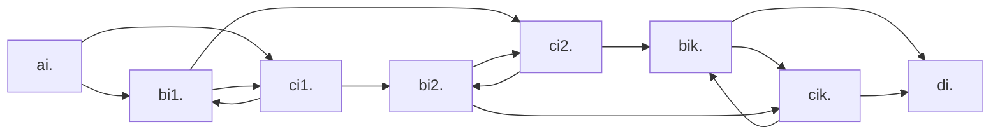
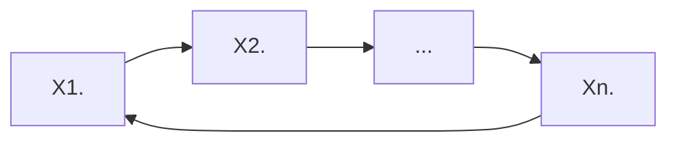
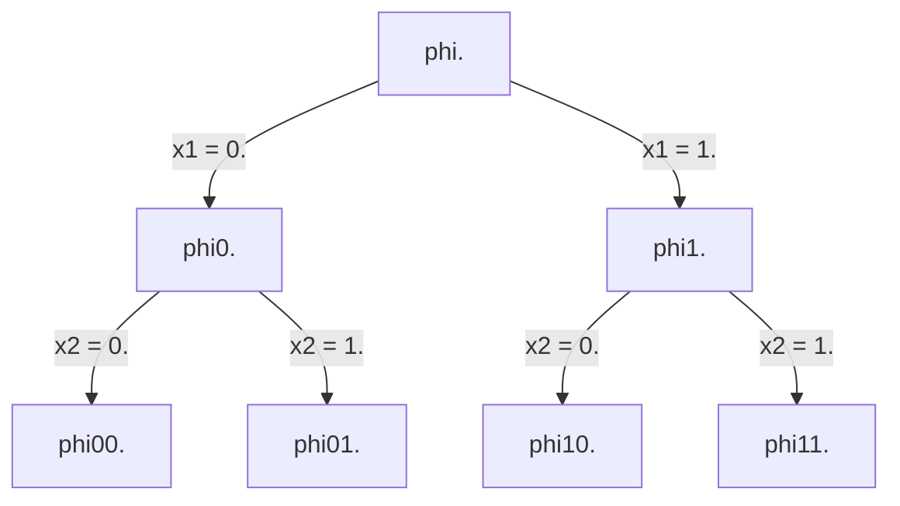

# теория сложности

> **literature:**
>
> *   Arora Barak "Complexity Modern Approach" (1st part)
> *   Garry Johnson "Трудно разрешенные задачи"
> *   site: compendium of NP-complete problems
>
> **outline:**
>
> [TOC]

## NP-полнота

Характеристики сложности вычисления.
Есть распознователи ($\Sigma^* \rightarrow B$) и преобразователи ($\Sigma^* \rightarrow \Sigma^*$)

+ время: $T(n) = O(f(n))$
+ память: $S(n)$
+ random: $R(n)$

$DTIME(f) = \{L\ |\  \exists\ program\ p : \\ 1. \ x \in L \implies p(X) = 1, x \notin L \implies p(x) = 0 \\ 2.\ n = |x| \implies T(p, x) = O(f(n))\}$

$h = (01)^* \in DTIME(n)$

$\widetilde{DTIME(f)} = \{h\ |\ ...\}$

палинромы: $Pal \in DTIME_{RAM}(n)\\ Pal \notin DTIME_{TM}(n)$

$P = \cup_{f - polynom} DTIME(f) = \cup^\infty_{i = 0} DTIME(n^i)$

$p(n) q(n): p + q, p * q, p(q(n))$
$L_1 L_2 \in P:  L_1 \cup L_2 \in P, L_1 \cap L_2 \in P, \overline{L_1} \in P, L_1 L_2 \in P, L_1^* \in P$

### концепция недетрминированных вычислений

Допускается $\iff \ \exist$ последовательность переходов, которая приводит к допуску
недетерминировання программа p(x) допускает $\iff \ \exist$ последовательность недетерминированных выборов, приводящая к допуску
p(x) не допускает $\iff \ \forall$ последовательности выборов не допуск

**def** ==*NTIME(f)*== = $\{L \ | \ \exist$ недетерминированная программа  p $1) \ p(x) - acc \iff x \in L; \ 2) \ T(p, x) = O(f(n))\}$

>   **ex** задача о гамильтоновом цикле
> ```
> p(G)
>     vis[1..n]: arr of bool
>     s = 1
>     for i = 1..n
>         u = ?{1..n}
>         if (vis[u]) return false
>         if (su not in EG) return false
>         vis[u] = true
>         s = u
>     if (s != 1) return false
>     return true
> ```


> **ex** `isComposite(z)`, $n = \lceil \log_B z \rceil$, где B - это основание системы счисления
>
> ```
> a = ?{2..z-1} // T = logn
> if z % a = 0  // poly(logn)
>     return true
> return false
> ```

Нельзя свопнуть бранчи и сделать проверку на простоту, потому что это `true` и `false` не симметричны в недетерминированных вычислениях (нельзя даже `isPrime(n): return !isComposite(n)`)

---

**def** ==*NP*== = $\cup_{f - polynome}\ NTIME(f)$, *nondeterministic polynomial*
**stat** $P \sub NP$

**?** $P = NP$

*неформально*: класс P - класс задач, которые можно решить за полином, класс NP - класс задач, решение которых можно проверить за полином

$\Sigma_1$ - класс языков, в которых можно формализовать класс решения, которое можно проверить за полином
$\Sigma_1 = \{L \ | \ \exist$ полином p, работающая за полином программа R(x, y) - детерминированная
$x \in L \iff \exist \ y $ (называют *сертификат*)$: \ |y| \leq p(|x|) \ and\  R(x, y) = 1$
$x \notin L \implies \forall \ y\ (|y| \leq p(|x|)) \ R(x, y) = 0 \}$

> **ex** гамильтонов цикл $Ham \in \Sigma_1$
> ```
> R(G, y):
>     y as arr[1..n] of int
>     // we can add: y = ?arr[i..n] of {1..n} // O(n)
>     vis = arr[1..n] of bool
>     for i = 1..n
>         if (y[i] y[i mod n+1] not in EG) return false
>         if vis[y[i]] return false
>         vis[y[i]] = true
>     return true
> ```

---

**Th** $NP = \Sigma_1$
$L \in NP$, $L \in \Sigma_1$
*неформально*: NP – определение на языке недетерминированных формат, $\Sigma_1$ – определение на языке сертификатов

---

## сведения

**def** ==сводим B к A *по Тьюрингу*==:  А, B – языки, C – сложностный класс, $B \in C^A$ (C  с *оракулом* A). не считая вызова функции `isInA(x): Bool`, остальные ограничения класса C учитываются.

**def** ==сведение по *Куку-Левину*== *(Тьюрингу за полином)* $B \in P^A$

**def**<a name="Karp"> </a>==*сведене по Карпу*== *(m-сведение)*: язык B сводится к A ($B \leq A$), если $\exist$ вычислимая за полином функция f такая, что $x \in B \iff f(x) \in A$

>   **ex** $IND = \{\langle G, k \rangle  |$ $ в $ $\ G \ d$ независимое множество размера k $\}$
>   $CLIQUE = \{\langle G, k \rangle  |$ в $ G \exist$ клика размера k$\}$
>   $IND \leq CLIQUE$
>   $f(\langle G, k \rangle ) = \langle \overline{G}, k \rangle $ // за полином
>   в G и множестве размера k $\iff$ в $\overline{G} \ \exist$ клика размера k
>   $VCOVER = \{\langle G, k \rangle  |$ в $G \ \exist$ вершинное покрытие размера  $k\ \}$
>   $IND \leq VCOVER$
>   $f(\langle G, k \rangle ) = \langle G, n - k \rangle $, где n - число вершин G

>   **ex** $SUBSETSUM = \{\langle [x_1, x_2, ..., x_n], s \rangle \ | \ \exist I \subset \{1,2, ..., n\}, \sum_{i \in I} = s, x_i \in \N\}$
>   `dp[i][w]` - можно ли первые i $\Sigma = w$ // w - $2^{|s|}$
>   $VCOVER \leq SUBSETSUM$
>   пронумеруем вершины с единицы, рёбра – с нуля, битовыми масками каждой вершине сопоставляем рёбра
>
>   ```mermaid
>   graph LR;
>       1 --1--- 2
>       2 --2--- 3
>       3 --3--- 5
>       3 --4--- 4
>       4 --5--- 5
>       5 --0--- 1
>   ```
>
>   |       | 6    | 5    | 4    | 3    | 2    | 1    | 0    |
>   | ----- | ---- | ---- | ---- | ---- | ---- | ---- | ---- |
>   | $x_1$ | 1    | 0    | 0    | 0    | 0    | 1    | 1    |
>   | $x_2$ | 1    | 0    | 0    | 0    | 1    | 1    | 0    |
>   | $x_3$ | 1    | 0    | 1    | 1    | 1    | 0    | 0    |
>   | $x_4$ | 1    | 1    | 1    | 0    | 0    | 0    | 0    |
>   | $x_5$ | 1    | 1    | 0    | 1    | 0    | 0    | 1    |
>   | s     | 3    | 2    | 2    | 2    | 2    | 2    | 2    |
>
>   $x_6 = 1\\ x_7 = 10 \\ x_8 = 100 \\ x_9 = 1000 \\ x_{10} = 10000 \\ x_{11} = 100000$
>   $f(\langle G, k \rangle)$, n - число вершин, m - число рёбер, $s = k22...2$, m двоек
>
>   f сводит VCOVER к SUBSETSUM
>   $\Rightarrow$: в G $\exist$ вершинное погрытие размера k
>   $\Leftarrow$: $[x_1 ..., x_{n + n}], s \ \exist$ решение $\Rightarrow$ в $G \ \exist$ вершинное покрытие размера k

**def** язык называется ==*NP-hard*== (*NP-трудный*), если выполнены следующие условия:
       $\forall B \in NP: B \leq A$
**def** A называется ==*NP-complete*== (*NP-полный*), если:
       1) $A \in NPH$
       2) $A \in NP$
       // $NPC = NPH \cap NP$

>   **ex** $BH_{1N}$ (bounded halting unary nondeterministic)
>   $BH_{1N} = \{\angle m, x, 1^t \rangle \ | $ m – недетрминировання машина тьюринга, x – вход, t – ограничение времени: $\exist$ последоватеьность недетерминировання выборов машины Тьюринга m, что она допускается за t шагов: `m(x) = 1`$\}$
>
>   **Th** $BH_{1N} \leq NPC$
>
>   1.  $BH_{1N} \in NPH$
>        $A \in NP$
>        // [def по Карпу](#Karp)
>        $m_A$ - недетерминировання машина Тьюринга, решающая A за полином $p(n) = c n^k$
>        $f(x) = \langle m_A, x, q^{p(|x|)} \rangle$
>        $x \in A \iff \exist$ последовательность выборов $m_A(x) = 1$ (за $p(|x|)$)
>   2.  $BH_{1N} \in NP$

**L** $A \leqslant^k B, B \leqslant^k C \implies A \leqslant^k C$
$x \stackrel{t}\rightarrow f(x) \stackrel{t}\rightarrow g(f(x))$
**con** $A \in NPH, A \leqslant B \implies B \in NPH$

**stat** если $B \leqslant A$, $A \in NPH$
$NP \stackrel{t}\rightarrow BH_{1N} \stackrel{t}\rightarrow SAT$

**def** ==$SAT$== $= \{\phi(x_q...x_n) \ | \ \exist x_1...x_n \ \phi(x_1...x_n) = 1, \phi - бф\}$


### **Th** *(Кук, Левин)* SAT in NPC

$SAT \in NPC$

$BH_{1N} \leqslant SAT$
$\langle m, x, 1^t \rangle \ \stackrel{f}\mapsto \phi$

$\phi$ удовлетворяет $\iff \ \exist$ последовательность недетерминированных выборов $m(x) = 1$, за время t

больше t шагов не будет, есть мгновенные описания машины $\alpha\#_q\beta$
дополним описания до длины t + 1
$q_0\vdash q_1\vdash...\vdash q_t$

*табло вычислений*: первая строка - стартовое состояние, $i \rightarrow i + 1, q_i \vdash q_{i + 1}$, допуск: последовательность до $\#_{acc}$

$\langle m, x, 1^t \rangle  \ \in BH_{1N} \iff \exist$ допускающее табло вычислений


количество состояний $|Q| = z$, множество ленточного алфавита $|PT| = y$, $z + y = k$
заведём $(t + 1)^2 k$ переменных, $x_{ijc}$ – верно ли, что в табло в i-й j-й ячейке записан символ 'c'

$\phi(x_{ijc}) = C \and S \and T \and N$

$C = \and{i, j = 0..t} \or_C ((\and \neg X_{ij\alpha}) \and X_{ijc})$

$S = X_{00\#_s} \and X_{01x_1} \and X_{02x_2} \and ... \and X_{0nx_n} \and X_{0(n+1)B} \and ...$

$T = X_{t0\#x} \or X_{t1\#_y} \or ... \or X_{tt\#_y}$

$N = (\and_{i, j} \and_{c_1 c_2 c_3 c_3 \notin Q} X_{i - 1, j -1, c_1} \and X_{i -1 , j, c_2} \and X_{i, j +1 , c_3} \and X_{i, j, c_4} \rightarrow c_1 = c_4) \and_{ijx} \and_{c_1...c_6...}$ допустимы

$qed \ \square$

---

## язык CNFSAT

**def** ==$CNFSAT$== $= \{\phi \ | \phi$ в КНФ$, \phi \in SAT\}$
$(x_i\or \neg  \ x_j ...) \and  (\or\or\or) \and (\or)$
*clause* (клоз)
**ex** 2-SAT (ровно две) HornSAT (не более одной без отрицания)

### Th CNFSAT in NPC

1.  $CNFSAT \in NP$
2.  $CNFSAT \in NPH$
    $SAT \leqslant CNFSAT$
    $\phi \stackrel {f\ \ (polynomial\ time)} \longrightarrow \psi$
    $\phi \in SAT \iff \psi = f(\psi) \in CNFSAT$

базис: $\and, \or, \neg$

строим дерево разбора нашей формулы $\phi$:

*   если у neg сын neg, то можем удалить
*   neg -> and/or => neg <- and/or -> neg neg

каждому поддереву соответствует преобразованная подформула $\phi_i(x_{i_1} ... x_{i_k})$ , хотим построить следующее: $\psi_i(x_{i_1} ... x_{i_k}, y_1 ... y_{i_t})$
$\phi(\overline X) = 1 \implies \exist \overline y \psi(\overline x, \overline y) = 1$
$\phi(\overline X) = 0 \implies \forall \overline y \psi(\overline x, \overline y) = 0$

| вершина | brand new $\psi$                                             |
| ------- | ------------------------------------------------------------ |
| X       | $\phi = X, \psi = X$                                         |
| neg X   | $\phi = \neg X, \psi = \neg X$                               |
| and     | $\phi_1 \and \phi_2, \psi_1 \and \psi_2$                     |
| or      | $\psi_1 \or \psi_2$ не можем написать, потому что это не будет в КНФ <br />новая переменная z: <br />$(\psi_1 \or z) \and (\psi_2 \or \neg z)$ |

>   получается, что число клозов равно числу листьев
>   внутри каждого клоза число вхождений равно число переменных + или

#clauses = #leaves
#entries = #vars + #or
poly

$\square\ qed$

### Th CNFSAT to 3SAT

>   $3SAT =CNFSAT \and 3CNF$

1.  $3SAT \in NP$
2.  $3SAT \in NPH$
    $CNFSAT \leqslant 3SAT$

| $\psi$                                                       | $X$                                  |
| ------------------------------------------------------------ | ------------------------------------ |
| $(x \or y \or u) \and (x \or y \or \neg u)$                  | $x \or y$                            |
| ok                                                           | $x \or y \or z$                      |
| вспомогательные переменные<br />k - 3 новые перменные:<br />$(x_1 \or x_2 \or t_1) \and (\neg t_1 \or x_3 \or t_2) \and (\neg t_2 \or x_2 \or t_3) \and ... \and (\neg t_{k - 3} \or x_{k - 1} \or x_k)$ | $x_1 \or x_2 \or ... \or x_k, k > 3$ |

$\square \ qed$

3SAT - superstar

## Th IND in NPC

дана формула $\phi$ в 3КНФ, мы хотим вывести граф G и число k, такие что $\phi$ удовлетворима тогда и только тогда, когда в графе есть независимое множество размера k
$\phi \in 3SAT \iff \langle G, k \rangle \in IND$

в $\phi$ k clauses, граф построим из k triangles
в вершинах переменные, соответствующие claus'ам
соединим переменные с их отрицанием

---

$HAM = \{G \ | \ G -$ ориентированный граф, содержит Гамильтонов цикл$\}$
$HAM\in NP$
$HAM \in NPH$

$\phi (x_1 x_2 ... x_n)$ k clauses
$x_i \rightarrow 2k + 2$ вершины





где X - это компонента предыдущего вида

---

## диагональный метод

### теоремы об иерахии

$DSPACE(f) = \{L \ | \ \exist$ программа p: $x \in L \implies p(x) = 1 \\ x \notin L \implies p(x) = 0$ $ S(p, x) = O(f(n))\}$
$PSACE = \cup_{p - polynom} DSPACE(p)$

**Th NP subset PS subset EXP**

**thesis** если p запускает q, q использует $O(f)$ памяти, то p может тоже для этого использовать$ O(f)$ памяти

#### Th о ёмкости иерархии

${f \over g} \to 0$ тогда $\exist L: L \in DSPACE(g)\backslash DSPACE(f)$

$h = \sqrt{fg}, \ \ {h \over g} \to 0, \ \ {f \over h} \to 0$

$n = |\langle p, x\rangle|$

$L = \{\langle p, x \rangle  \ | \ $неверно, что $(p(\langle p, x \rangle ) = 1, $ использовав $h(n)$ памяти $)\}$

$L \in DSPACE(g)$

Пусть $L \notin DSPACE(f)$, q - разрешает L, используя $\leqslant c f(n)$, рассмотрим $n_0: h(n_0) > cf(n_0)$, $n_0 > |q|$

рассмотрим $x: |\langle q, x \rangle | = n_0$

$q(\langle q, x \rangle ) = \  ?$

$q(\langle q, x \rangle) = q \implies \langle q, x \rangle \in L \implies !(q(\langle q, x \rangle) = 1 \ and \ S(q, \langle q, x \rangle) \leqslant cf(n) \langle  h(n_0)) \implies q(\langle q, x \rangle) = 0$

$q(\langle q,x \rangle) = 0 \implies \langle q, x \rangle \notin L \implies q(\langle q, x \rangle) = 1$


#### Th о временной иерархии

DSPACE -> DTIME, память -> время

ломается немного первая часть, так что новое условие:

${f \over g} \to 0, \exist h: {f \over h} \to 0, {sim(h) \over g} \to 0. \ \  (sim(h) = O(g))$ (где $sim(f)$ - за сколько можно просимулировать программу, работающую за f) тогда $\exist L: L \in DTIME(g)\backslash DTIME(f)$

$h = \sqrt{fg}, \ \ {h \over g} \to 0, \ \ {f \over h} \to 0$

$n = |\langle p, x \rangle|$

$L = \{l\angle p, x \rangle \ | \ $неверно, что $(p(\langle p, x \rangle) = 1, $ использовав $h(n)$ времени $)\}$

$L \in DTIME(g)$

Пусть $L \notin DTIME(f)$, q - разрешает L, используя $\leqslant c f(n)$, рассмотрим $n_0: h(n_0) > cf(n_0)$, $n_0 > |q|$

рассмотрим $x: |\langle q, x \rangle| = n_0$


> **Implies** $P \neq EXP$
>
> $f = n^{\log_2 n} = 2^{(\log_2 n)^2}$
> $g = 2^n$
> ${f \over g} \to 0 \implies \exist L \in DTIME(g) \backslash DTIME(f)$ (первая часть $\implies L \in EXP$, вторая – $\implies L \notin P$)


### Th (Бейкер, Гилл, Соловэй) BGS

$u = \{\langle p, x \rangle |\ \ p(x) = 1\}$
$uni(p, x) \to$ останавливается ли p на x

Вычисления с оракулом $p^A$ – p  с оракулом A

$\exist$ оракул $A: p^A = NP^A$
$\exist$ оракул $B: p^B \neq NP^B$

// **релятивизуется**, если доказательство остаётся верным, если всему фиксированному в программе добавить оракул

рассмотрим $A \in PSC$

$p^A \stackrel{1}\subset NP^A \stackrel{2}\subset PS^A \stackrel{3}\subset PS \stackrel{4}\subset P^A$:

1.  любая недетерминировання программа частный случай детерминированной
2.  релятивизуется
3.  можем заменить вызов оракула на процедуру проверки
4.  потому что взяли PSpace полный, любой сводится за полином и спросим у оракула

B   $U_B = \{x \ | \ \exist y \in B\ \ \  |x| = |y|\}$

**L** $\forall B \ \ U_b \in NP^B$

Придумаем $B: U_B \notin P^B$

---

Теперь рассмотрим часть $\exist$ оракул $B : p^B \neq NP^B$:

Построим последовательность программ $q_1, q_2, q_3, ...$
$T(q_i)$ - полином
$\forall L \in P : \exist i: q_i$ разрешает $L$

Рассмотрим все коды исходных программ, упорядочим их лексикографически и запустим

// n – это длина входа

|       | $n$  | $2 n^2$ | $3n^3$ | …    | $kn^k$               | …    |
| ----- | ---- | ------- | ------ | ---- | -------------------- | ---- |
| $p_1$ |      |         |        |      |                      |      |
| $p_2$ |      |         |        |      |                      |      |
| …     |      |         |        |      |                      |      |
| $p_m$ |      |         |        |      | $p_m \ | \ TL= kn^k$ |      |
| …     |      |         |        |      |                      |      |

каждая из этих программ работает за полином

нумеруем эту табличку по диагонали

получим счётное множество пронумерованных программ

если программа не успела завершиться за TL, то говорим, что $q_i$ возвращает 0

---------

так же можем занумировать все программы с оракулами: $q_1^\bullet, q_2^\bullet, ..., q_n^\bullet, ...$

должны сделать $B : p^B \neq NP^B$

рассмотрим $B: U_B = \{x \ |\ \exist y : |x| = |y|, y \in B\}$

**L** $\forall B: U_B \in NP^B$

>   ```
>   ub(x)
>       y <- недетерминированно Sigma^|x|
>       return check(y)
>   ```

Построить $B: U_B \notin p^B$ (если построим такое B, то теорема БГС доказана)

$B_1: q_1^{B_1}$ не распознавала $U_{B_1}$

запустим $q_1$ с оракулом и будем выступать в роли оракула

$q_1^\bullet(x_1)$ : спрашивает оракула $?y_1 \rightarrow NO$ (пишем в map наши ответы) $?y_2 \rightarrow NO \  ... \ ?y_k \rightarrow NO$

// выберем $x_`: T(q_1, x_1) < 2^{|x_1|}$

если результат программы $YES: \ \forall z \ |z| = |x_1|: z \notin B_1$
$NO: \ \exist z_1: q_1^\bullet(x_1)$ не задала вопрос про $z_1, \ |z_1| = |x_1|; \ z_1 \in B_1$

$B_1 \rightarrow B_2 \ q_1^{B_2}$ не распознаёт $U_{B_2}, q_2^{B_2}$ не распознаёт $U_{B_2}$
$T(q_2^\bullet, x_2) < 2^{|x_2|}, |x_2| > $ максимальной длины, для которого известно принадлежность $B_1$

теперь запускаем $q_2(x_2)$: спрашивает у нас: если спрашивали уже про это слово, то я то же самое и отвечаю, если нет, отвечаю $NO$ и записываю

$B_k \ \forall i \leqslant k : q_i^{B_k}$ не распознаёт $U_{B_k}$

опять находим $x_k$ и запускаем

тот же самый подход, что и выше, при запуске

этот процесс продолжается до бесконечности

для ответа БГС возьмём ==$B = \cup^\infty_{k = 1} B_k$==


// релятивизация – это *барьер* доказательства $P \neq NP$


### Th *Ладнера*

$P \neq NP \implies \exist L: L \notin P, L \notin NPC, L \in NP$

>   иллюстрация, **не** доказательство
>
>   *Blowing Holes in SAT*
>
>   координатная ось с итерированным логарифмом
>
>   $1 \rightarrow 10 \rightarrow 10^{10} \rightarrow 10^{10^{10}}$
>
>   выбираем нечётные промежутки
>
>   $SAT0 = SAT \ \cap\ EVEN$
>
>   $EVEN = \{x \ | \ log^*_{10}|x|$ чётен $\}$
>
>   к нему сводится $SAT$:
>
>   $\exist f : x \in SAT \iff f(x) \in SAT0$
>

так же, как в теореме БГС, у нас есть последовательность $q_1, q_2, ..., q_n, ...$ , так же запускаем программу $p_i$ с таймером $jn^j$  и так же занумеровали программу по диагонали: $f_1 ... f_i ...$

все $f_i$  работают за полином

$L = SAT \ \cap \ EVEN\ (SAT \ \cap \ \{\phi \ | \ |\phi|$ в "чёрном" куске $\})$

рассмотрели первый чёрный кусок, префикса которого достаточно, чтобы программа $q_1$ не разрешала $L$ за полином

теперь рассмотрим некст белый кусок: добъёмся того, чтобы сведение $f_1$ неправильно сводило $SAT$ к нашему языку

занумеруем формулы по возрастанию длины и дальше лексикографически: $\phi_1, \phi_2, ...$

$\phi_1 \stackrel{f_1} \rightarrow z_1 \\ \phi_2 \rightarrow z_2\\...$

найдётся формула $\phi_x \stackrel{f_1} \rightarrow z_x: \phi_x \in SAT \neq z_x = f_1(\phi_x) \in L$

найдётся такая $\phi_x$ потому, что  если бы не нашлось, то получили бы противоречие в том, что $SAT$ сводится за полиномальное время под действием $f_1$ к конечному языку

$z_x$ лежит либо в первом чёрном отрезке, либо во втором белом
$n_2 = max(n_1 + 1, |z_x|)$

> **Lemma** $L \in NPC, F -$ конечный, $L \setminus F \in NPC$
> $L \leqslant L \setminus F$
>
> ```
> f(x):
>        if x in F
>            if x in L return YesWord
>            else return NoWord
>        else retun x
> ```

построим $BLACK$:

1.  $x \in BLACK$ – зависит только ок $|X|$
2.  $BLACK \in P$
3.  $L \notin NPC, L \notin P$

разрешитель $BLACK$: (верно ли, что слова длины $n$ принадлежат нашему языку, пусть работает за n)

```
black(x: String)
    a = black(|x|)
    return x in BLACK // основываясь на данных из массива a

black(n): List<Int>
// [n1, n2, ..., nk] - список всех границ, которые не превышают n
// ограничение по времени n^(большое число, пусть 100)
    if n = 0 return []
    a = black(n - 1)
    // black(n - 1) отработала за T <= (n - 1)^100, T_left >= n^99
    set Timer on n^99, if triggered return a
    if len(a) чётна:
        i = len(a) / 2 + 1
        for (phi - формула, |phi| <= n):
            if (phi in SAT intersect BLACK != q_i(phi))
                return a ++ [n]
    else // len(a) нечётна
        i = (len(a) - 1) / 2 + 1
        for (phi - формула, |f_i(phi)| <= n):
            if (phi in SAT != f_i(phi) in SAT intersect BLACK):
                return a ++ [n]
    return a
```

---------

## coNP

**def** ==$coNP$== $= L \ | \ \overline L \in NP$

>**ex** $SAT \in NP,\\ \overline{SAT} \in coNP$
>
>есть все слова $\Sigma^*$, среди них есть булевы формулы и давайте рассматривать только булевы формулы, они делятся на $SAT$ и на $\overline {SAT}$ , а на небулевы формулы забьём
>
>$\overline{SAT} = \{\phi \ | \ \forall \stackrel \rightarrow x: \phi(\stackrel \rightarrow x ) = 0\} $

>**ex** $FACTORIZATION = \{\langle n, x \rangle \ |$ у  $n \ \exist$ простой делитель $\leqslant x \} \in NP \cap coNP$
>
>(P candidate)


## PSpace и PSpace полнота

**def** ==$PS$== $= \cup_{p - polynom} DSPACE(p)$

$P \subset NP \subset PS \subset EXP$

**def** $L \in$ ==$PSH$== : $\forall A \in PS: \ A \leqslant L \  (f  \ - $ за полином $x \in A \iff f(x) \in L)$

**def** $L \in$ ==$PSC$==: $1) \ L \in PSH \\ 2) L \in PS $

>   **ex** булевы формулы с квантора (матлог референс)
>   $TQBF$ (True Quantified Boolean Formula) $= \{\phi \ | \ \phi \ - $ булева формула с кванторами, $Free(\phi) = \empty \ \ val(\phi) = 1\}$

### TQBF in PSC

1.  $TQBF \in PS$
    построим дерево разбора и храним множество значений текущих свободных переменных

2.  $TQBF \in PSH$
    рассмотрим $L \in PS, \ L \leqslant TQBF$
    m - машина Тьюринга, разрешающая L, детерминировання, $S(m, x) \leqslant p(n) \ $//$ \ n = |x|$

    $m(x) \ \ q_o \vdash q_1 \vdash q_2 \vdash ... \vdash q_t$

    $f : x \rightarrow \phi$

    $\phi \ -$ истина $\iff m(x) = 1$

    $X_{ijc} \ -$ ячейка $(i, j)$ содержит символ $c$

    $Q_i = [X_{i0c_1}, X_{i1c_1}, ..., X_{ip(n)c_1}, X_{i0c_2}, ..., X_{ip(n)c_2}]$

    $S(Q_0) \ \cap \ T(Q_t) \ \cap \ C \ \cap \ N$

    введём синтаскический сахар: $\exist (\forall) Q_i := \exist (\forall) X_{i0c_1} , \exist (\forall) ...$

    $Q_i \vdash Q_{i + 1}$

    $\exist Q_0 \ \exist Q_1 \ .. \exist Q_t \ S(Q_0) \ \and \ T(Q_t) \ \and \ C \ \and \ Q_0 \vdash Q_1 \ \and\  Q_1 \vdash Q_2 \ \and\  ... \ \and\  Q_{t - 1} \vdash Q_t$

    выведенная формула плоха её длиной: $Q(Q_0), \ T(Q_t), \ Q_0 \vdash Q_1$ имеют длину $p(n)$, но последних кусков $t$, таким образом вся формула имеет длину $p(n) 2^{q(n)}$,  а это не полиномиальное сведение

    $Q \vdash R$

    $\vdash \ -$ булева формула от $2 \ (p(n) + 1) \ z$ аргументов

    $Q \vdash R := Q \underbrace{\vdash U_1 \vdash U_2  ... \vdash U_{2^{m} - 1} \vdash R}_{2^m}$

    $\vdash_m = \vdash^{2^m}$

    $Q \vdash_m R = \exist \ T \ (Q \vdash_{m - 1} T \ \and \ T \vdash_{m - 1} R)$

    $Q \vdash_m R = \exist \ T \ \forall A \ \forall B \ (\neg (A \vdash_{m - 1} B) \rightarrow (Q \neq A \or B \neq T) \and (T \neq A \or B \neq R))$

    $len(m) = O(p(n)) + len(m - 1) \implies len(m) = O(p(n)  \ m)$

$\square$

---------

// PS proof template: $PS \rightarrow TQBF \rightarrow L$


### Th NSPACE(f(n)) subset DSPACE(f(n)^2^)

$f(n) \geqslant log(n)$
$NSPACE(f(n)) \subset DSPACE(f(n)^2)$

*Доказательство*:

Пусть $L \in NSPACE(f(n))$ $\exist$ недетерминирванная машина Тьюринга $x \in L \iff \exist$ последовательность недетерминированных выборов, m(x) = 1
$S(m, x) \leqslant f(n), \  n = len(x)$

вход — лента машины Тьюринга со словом $x$
рабочая — лента машины Тьюринга с $f(n)$
конфигурация машины Тьбринга кодируется:$ (pos, work)$, где $work = \alpha \#_p \beta$, длина $pos = log(n)$ , а длина $work = f(n) + 1$, и тогда вся длина пары — $O(f(n))$

Существует ли последовательность переходов длиной $2^{c \ f(n)}$, которая $q_0$ переводит в допускающую конфигурацию $q_t$

заведём функцию (можно ли достичь): $Reach(q_s, q_t, k)$ (можно ли из $q_s$ перейти за $2^k$ шагов до $q_t$ ($q_s \vdash^{2^k} q_t$))

```
Reach(qs, qt, k):
    if (k = 0):
        return qs |- qt
    for (qm - конфигурация машины Тьюринга m):
        if Reach(qs, qm, k - 1) and Reach (qm, qt, k - 1):
            return True
    return False
```

локальные переменные функции `Reach` занимают $f(n)$, суммарно памяти нам понадобится $O(k \ f(n))$

```
inL(x):
    qs - стартовая конфигурация m
    for (qt - допускающая конфиграция m):
        if Reach(qs, qt, c * f(|x|)):
            return 1
    return 0
```

$q_s$ требует $f(n)$ памяти
вызов `Reach` требует $f(n)^2$ памяти
локальная переменная $q_t$ требует $f(n)$ памяти


#### Следствие Th (*Сэвитча*)

$PS = NPS$


## Сублинейная память

Полином памяти $PS$
Экспонента памяти $EXPSPACE,\  EXP \subset NEXP \subset EXPSPACE$

$DSPACE(f(n)), f(n) = \overline{\overline o}(n)$


Миниальный логичный класс возникающий – это $DSPACE(1)$ (в контексте машины Тьюринга можем хранить только состояние) $ = Reg = NSPACE(1)$

$DSPACE(log \ n) = L$

$NSPACE(log \ n) = NL$

можно:

1.  целочисленные переменные $value \leqslant n^c$ (константное количество)
2.  массив bool: $len \leqslant c * log \ n$

нельзя:

1.  массивы $\Omega(n)$
2.  рекурсия $\Omega(n)$

>   **ex** проверка на палиндром
>
>   ```
>   pal(s)
>       n = len(s)
>       for i = 0..n/2
>           if s[i] != s[n - 1 - i]
>               return False
>           return True
>   ```

> **ex** проверка пути в графе недетерминированно
>
> ```
> reach(G, s, t)
>     if (s = t) return True
>     n = num vert(G)
>     u = s
>     for i = 1..n
>         v = ? {1..n}
>         if uv not in E
>             return False
>         u = v
>         if u = t
>             return True
>     return False
> ```
>
> переменные `n, u, i, v` и на проверку `not in E` – константное количество размера n

$L \subset NL \subset DSPACE(log^2 \ n) \subset PS$


### stat NL subset P

$A \in NL$

$\exist$ машина Тюринга, разрешающая $A$

граф G, вершины – конфигурация m (state (const), pos (n), mem (const^(c log n))), рёбра – переходы m

полиномиальное количество состояний

m допускает x $\iff$ в G $\exist$ путь из (s, 1, 0…00) в вершину (допускающее, *, *)

---

$\forall A \in NL \ \ A \leqslant Reach$

==$LOGSPACE$-сведение==

**def** $A \leqslant_L B$, если $\exist f \ S(f, x) \leqslant c * log \ |x| \ \ : x \in A \iff f(x) \in B$

**def** $A$ ==$P$-complete==:

1.  $A \in P$

2.  $\forall B \in P: B \leqslant _L A$

**def** $A$ ==$NL$-complete==:

1.  $A \in NL$
2.  $\forall B \in NL: B \leqslant_L A$

можно переписать утверждение как $Reach \in NL-complete$


### Th транзитивность LOGSPACE-сведения

$x \stackrel f \longrightarrow y \stackrel g \longrightarrow z$

$x \in A \iff y \in B \iff z \in C$

$g$ работает и умеет спрашивать $i$-ый символ слова $y$, в таком случае вызываем $f(x)$, получаем символ, всё остальное выбрасываем

итого памяти надо $mem(f) + mem(g) +$ служебные = логарифм памяти


### Th CIRCVAL in P-complete

> $CIRCVAL = \{\langle C, \stackrel \rightarrow x \rangle \ | \ C$ - схема из функциональных элементов, $\stackrel \rightarrow x$ - входы, $C(\stackrel \rightarrow x) = 1\}$
>
> Не путать с $CIRCSAT = \{c \ | \ \exist \stackrel \rightarrow x: C(\stackrel \rightarrow x) = 1\}$

$CIRCVAL \in P$

докажем теперь, что все из $P$ сводятся к ней (аналогично теореме Кука):

$A \in P$, $m$ — детерминированная машина Тьюринга, $m$ разрешает $A$, $m$ работает за $p(n)$

$x \stackrel f \longrightarrow  C, \stackrel \rightarrow x$
$x \in A \iff C(\stackrel \rightarrow x) = 1$


### Th (Иммермана) NL = coNL

> $coNL = \{A \ | \ \overline A \in NL\}$

$NReach = \{\langle G, s, t \rangle \ | \ $в $G$ не $\exist$ пути из $s \longrightarrow t \}$

```
NoPath(G, s, t, c) // c - количество вершин, достижимых из s
    for u = 1..n
        if (?) // достижима ли
            c--
            if not Reach(G, s, u)
                return False
            if (u == t)
                return False
    return c == 0
```

```
Next(G, s, c) -> Int
// c - достижимы из s путями len <= k
// возвращает достижимые из s путями len <= k + 1
    r = 0
    for u = 1..n
        if u достижимо len <= k || u достижимо len = k + 1
        // 1: for v -> (?) достижимо или нет, если да, то угадываем путь
        // 2: for v -> (?) достижимо или нет, если да, то угадываем путь
        // и перебираем рёбра
            r++
    return r
```

```
NReach(G, s, t)
    c = 1 // достижимые путями len <= 0
    for i = 1..n - 1
        c = Next(G, s, c) // c: len <= n - 1
    return NoPath(G, s, t, c
```

$coNL \subset NL$

$coNL = NL$


## Sparse

**def** ==$Sparse$ (*редкие языки*)== = $\{L \ | \ \exist $ полином $p \ \forall n \ | \Sigma^n \cap L | \ \leqslant p(n)\}$

// для каждой длины не больше полинома слов этой длины

**ex** *язык простых чисел, заданных в унарной системе счисления*: $Primes_1 = \{1^p \ | \ p$ — простое $\}$

**ex** $Fact_1 = \{\langle 1^n, 1^\alpha \rangle \ | \ d$ - минимальный делитель n $\}$


### Th Бермана-Форчуна

$coNPC \cap Sparse \neq \empty \implies P = NP$

-----

$S \in coNPC \cap Sparse \implies P = NP$

$\sphericalangle \ TAUT \in coNPC$: $f$ сводит $TAUT$ к $S$ за $q$


```
taut(phi(x1, ..., xn)):
    if n == 0
        return eval(phi)

    phi1 = phi w/ x1 = 1
    phi0 = phi w/ x1 = 0

    if taut(phi1) and taut(phi0)
        return True
    return False
```


добавим меморизацию:

```diff
  // memorization
+ memo: set<formula> // формулы, которые точно являются тавтологиями

  taut(phi(x1, ..., xn)):
      if n == 0
          return eval(phi)

+     if phi in memo
+         return True

      phi1 = phi w/ x1 = 1
      phi0 = phi w/ x1 = 0

      if taut(phi1) and taut(phi0)
+         memo.add(phi)
          return True
      return False
```


$\phi \in TAUT \iff f(\phi) \in S$

$\phi \in memo \implies \phi \in TAUT$


давайте хранить теперь $f(\phi)$ вместо $\phi$:

$z \in memo \implies z \in S \implies (z = f(\phi) \implies \phi \in TAUT)$

```diff
  // memorization
+ memo: set<string>

  taut(phi(x1, ..., xn)):
      if n == 0
          return eval(phi)

+     z = f(phi)
+     if z in memo
          return True

      phi1 = phi w/ x1 = 1
      phi0 = phi w/ x1 = 0

      if taut(phi1) and taut(phi0)
+         memo.add(z)
          return True
      return False
```


$|\phi| = L$
все формулы, от которых вызывается `taut` имеют длину $\leqslant L$
$|z| \leqslant q(L)$
$|S \cap \Sigma^n| \leqslant p(n)$
`memo.size()` $\leqslant \sum_{n = 0}^{q(L)} p(n) \leqslant p(q(L)) * q(L)=r(L)$

`memo.size()` $\leqslant r(|\phi|)$

$\square$


### Th Мэхэни

$NPC \cap Sparse \neq \empty \implies P = NP$

---

> $SAT \in NPC$
> $LSAT = \{\langle \phi(x_1, ..., x_n), [y_1, ..., y_n] \rangle \ | \ \exist z_1 ... z_n: z_1...z_n \leqslant y_1...y_n, \phi(z_1, ..., z_n) = 1 \}$

**L** $LSAT \in NPC$

1. $LSAT \in NP$ сертификат $\stackrel \rightarrow z$
2. $SAT \leqslant LSAT$   $\phi \in SAT \iff \langle \phi, [1...1] \rangle \in LSAT$

$f$ сводит $LSAT$ к $S$: $\langle \phi, \stackrel \rightarrow y \rangle \iff f(\phi, \stackrel \rightarrow y) \in S$

$LSAT \stackrel f \leqslant S$


подобие поиска в ширину:



$[\phi_1, \phi_2, \phi_t]$
на каждом $k$-ом слое $n-k$ переменных
выберем одну переменную и положим их = 0 и = 1, положим в общую очередь

при $k = n$ в формулах 0 переменных, вычисляем слева направо, пока не найдём равное единице
не нашли — формула не удовлетворима, нашли — нашли минимальное лексикографически удовлетворяющее назначение $\phi$

на очередном $k$-ом слое: $[\phi_1, \phi_2, \phi_t]$
для каждой формулы запишем $\stackrel \rightarrow a$ — вектор, откуда взялась эта формула
применим к парам
$z_i = f(\phi, \underbrace {\stackrel \rightarrow {a_i}111...111}_n), \  ...$
$\stackrel \rightarrow {a_i}$ лежит на пути к минимальному лексикографически удовлетворяющему

$z_1 \notin S, z_2 \notin S, \ ..., z_i \in S, ... \in S$

$|\langle \phi, \underbrace {1..1}_n \rangle | = L$
$\phi_i(x_{k+1}...x_n) \leqslant q(L)$

$| S \cap \Sigma^n | \leqslant p(n)$

различных $z_i \in S$ не больше $p(q(L)) * q(L)$

$z_k = z_j, k < j$
$j \neq i$
из пар равных оставим того, кто раньше

$z_{v_1}, z_{v_2}, ..., z_{v_u}$ — различны

если $u > p(q(L)) * q(L)$, то оставим последние $p(q(L)) * q(L)$

$t \leqslant 2 * p(q(L)) * q(L)$

всё время работы за полином, решили $SAT$ за полином, получается $P = NP$

$\square$


## полиномиальная иерархия


$\sphericalangle \ NP$
$\Sigma_1 = \{L \ | \ \exist$ полином $p, R$ (checker), выполняется за полином, $x \in L \iff \exist y, |y| \leqslant p(|x|), R(x, y) = 1 \}$

$\sphericalangle \ coNP$
$\Pi_1 = \{L \ | \ \exist$ полином $p, R,$ выполняется за полином
$(x \notin L \iff \exist y, |y| \leqslant p(|x|), R(x, y) = 1)
$
$x \in L \iff \forall y, |y| \leqslant p(|x|), \overline R(x, y) = 1 \}$

$\Sigma_k = \{L \ | \ \exist$ полином $p, R$ (checker), выполняется за полином, $x \in L \iff \exist y_1 \forall y_2 \exist y_3 ... Q y_k, |y_i| \leqslant p(|x|), R(x, y_1, ..., y_k) = 1 \}$

$\Pi_k = \{L \ | \ \exist$ полином $p, R,$ выполняется за полином $x \in L \iff \forall y_1 \exist y_2 \forall y_3 ... Q y_k, |y_i| \leqslant p(|x|), \overline R(x, y_1, ..., y_k) = 1 \}$

$k = 1 \rightarrow \Sigma_1 = NP, \ \Pi_1 = coNP$

$k = 0 \rightarrow \{L \ | \ \exist R$, вычислимое за полином, $x \in L \iff R(x)\}$, $\Sigma_0 = \Pi_0 = P$


$MinF = \{\phi \ | \ \phi$ — минимальная по длине булева формула для своей функции $\}$
$\phi \in MinF \iff \forall \psi$ (функция $\psi =$ функция $\phi \implies |\psi| \geqslant |\phi|$)
($|\psi| \geqslant |\phi|) \or ($функция $\psi \neq$ функция $\phi)$
($|\psi| \geqslant |\phi|) \or (\exist x_1 ... x_n \phi(x_1 ... x_n) \neq \psi(x_1 ... x_n))$

$\phi \in MinF \iff \forall \psi \ \exist \stackrel \rightarrow x ((|\psi| \geqslant |\phi|) \or \phi(x_1 ... x_n) \neq \psi(x_1 ... x_n))$

$MinF \in \Pi_2$


## Схемная сложность

### Схема из функциональных элементов

булева формула $f: B^n \rightarrow B$
программа $p: \Sigma^* \rightarrow B$

**non-uniform computations**
$\forall n\ \ C_n \ \ B^n \rightarrow B$
$L \subset \Sigma^* \ \{C_0, C_1, C_2, ..., C_n, ...\}$

**parallel computation**
$L \subset \Sigma^* \ \{C_0, C_1, ..., C_n, ...\}$
$p(n) \rightarrow C_n$, есть ограничения на эту программу p

ограничения, которые у нас есть, -- $size$, $depth$
функция $f$
==$SIZE(f)$== $= \{L \ | \ \exist$ семейство схем из функциональных элементов $C_0 C_1 ... C_n ... \ \ C_i $ распознаёт $L \cap \Sigma^i, size(C_i) = O(f(i)) \}$
так же вводится ==$DEPTH(f)$==

==$P/poly$== (P by poly) $= \cup_{k = 0}^\infty  \ SIZE(n^k)$


> **ex** (**Th**) $P \subset P/poly$
>
> $L \in P \implies \exist$ детерминированная машина Тьюринга $m$, распознающая $L$
>
> работает за полином $q(n)$
>
> $n \rightarrow$ табло вычислений $q(n)$ на $q(n)$

> **ex** $UNARY = \{L \ | \ L \subset \{0\}^* \}$
> $UNARY \subset P/poly$
>
> $\forall n \ 0^n \in L C_n$ допускает только $0^n \downarrow_n$
> либо $0^n \notin L \ C_n \equiv 0$
>
>
>
> $HALT_1 = \{0^k \ | k-$ая программа завершается на пустом входе $\}$
> $HALT_1$ не разрешим, но принадлежит $UNARY$ и $P/poly$


### Программы с подсказками (advise)

$p(x, a_n)$, где $n = |x|$ и $a_n$ называется подсказкой

$L \in C/f \iff \exist$ программа $p$, удовлетворяющая ограничением класса C и $\exist a_0, a_1, ..., a_n, ... \ \  a_i \in \Sigma^* \ \ |a_i| \leqslant f(i) \ \ \forall x \ \ p(x, a_n) = [x \in L]$

#### Th P/poly = SIZE(poly)

$P/poly$ вычисление с подсказками $= SIZE(poly)$

$\supset$)  $L \in SIZE(poly) \implies \sphericalangle \ \ a_0 a_1a_n ... \ \ a_i = C_i \ \ p(x, a_i)$ вычисляет схему $a_i$ на $x$

 $\subset$)  $L \in P/poly$   $\sphericalangle \ n\ m -$ машина Тьюринга, построим схему и назовём её $C_n$


> $P \ vs\ NP$
>
> $NP \subset P/poly \implies P = NP$ -- неизвестно
>
> $NP\ !\subset P/poly \implies P \neq NP$


#### Th (Карпа-Липтона)

$NP \subset P/poly \implies \Sigma_2 = \Pi_2$

> **L** $NP \subset P/poly$
> $\exist C_0 C_1 C_2 ... C_n ...$ - схемы для $SAT$  $|C_i| \leqslant p(i)$ полином $p$
> тогда $\exist$ схемы $A_0 A_1 ... A_n ...$
>
> 1. $|A_i|$ -- полном от $i$
> 2. $A_i$ имеет $i$ выходов и если $\phi \in STA \implies \phi(A_i(\phi)) = 1$
>
>
>
> $\phi \rightarrow [SET \ \ x_1 = 1] \rightarrow \phi |_{x_1 = 1} \rightarrow [C_i] \rightarrow (\phi |_{x_1 = 1} \in SAT)$

$\sphericalangle \ L \in \Pi_2$, докажем $L \in \Sigma_2$

$R(x, y, z)$ -- полиномиальная детерминированная машина Тьюринга

$x \in L \iff \forall y \ \exist z\ R(x, y, z)$

$T = \{\langle x, y \rangle \ | \ \exist z \ R(x,y, z\}$

$x \in L \iff \forall y \ \langle x, y \rangle \in T$

$T \in NP \implies T \leqslant^f SAT$

$x \in L \iff \forall y \ f(\langle x, y \rangle) \in SAT$ //       $|y| \leqslant q(|x|)$            $|\langle x, y \rangle | \leqslant r(n)$

$x \in L \iff \exist [A_0 A_1 ... A_{r(n)}]$ 1) $A_i$ -- схемы из леммы, 2) $\forall y \ \ \phi :=  f(\langle x, y \rangle) \ |\phi| = m, \phi(A_m(\phi)) = 1$

1)  $\iff \forall |\phi| \leqslant r(n): \ \ (\forall z \ \phi(z) = 0 \or \phi(A_m(\phi)) = 1)$


$x \in L \iff \exist A_0 A_1 ... A_{r(n)} \ \forall \phi \forall z \forall y (\phi(z) = 0 \or \phi(A_{|\phi|} (\phi) = 1) \and \phi := f(x, y) \ \psi(A_{|\psi|} (\psi)) = 1$


### Параллельные вычисления

**def** ==$NC^i$== (_Nick's class_) $= \{L \ | \ \exist$  схемы из функциональных элементов $C_ k,\ size(C_k) \leqslant poly(k), \ \ depth(C_k) \leqslant c\   log^i(k), \ \ C_k$  может быть выведено по $k$, используя $O(log \ k)$ памяти $\}$
==$NC$== $= \cup_{i = 0}^\infty \ NC^i$

**def** ==$AC^i$== (_Aaron's class_) -- то же самое, но $\or$ и $\and $ могут иметь неограниченное число входов
==$AC$== $= \cup_{i = 0}^\infty \ AC^i$

$AND(x_1...x_n) \in NC^1 \cap AC^0$
$PARITY(x_1...x_n) \in NC^1 \setminus AC^0$
$SUM(x_1...x_ny_1...y_n) \in \widetilde {NC^1}$

**Th** $NC^i \subset AC^i \subset AC^{i + 1}$
**Cons** $AC = NC$
**Th** $L \subset NC \subset P$


## Вероятностные сложностные классы

$\sphericalangle \ L$ и $p$ – вероятностная программа для $L$

1.   ==нульстороння ошибка==: $x \in L \iff p(x) = 1, \ T(p, x)$ – случайная величина
2.  ==односторонняя ошибка==: $x \in L \implies p(x) = 1$ (false positive), $x \notin L \implies p(x) = 0$ (false negative)
    **ex** тест Миллера-Рабина на простоту
3.   ==двусторонняя ошибка==


### Введение вероятности

#### Способ 1. Вероятностная лента

**ex** linux `/dev/urand`

есть доступ к вероятнстной ленте — односторонней бесконечной последовательности символов какого-то алфавита

множество всех вероятностных лент — $\Omega$

#### Способ 2. Генератор случайных чисел

**ex** `random(n) -> [0, n - 1]`


способы **эквивалетны**


### События, связанные с программой

**Thesis**  $\forall$ множество $R \subset \Omega$, задающее множество вероятностных лент, приводящих рещультат работы программ, является событием

>   **Proof** $R = \{r \ | \ A(p,r,x)\}$, выполняется какой-то предикат $A$
>
>   $R = \cup_{i = 0}^\infty r_i$,   $r_i = \{r \ | \ A(p,r,x) \ \and $ считан $i$ бит с вероятностной ленты $\}$
>
>   $R_i = \{r = z\{01\}^* \ | \ z \in Z_i\}$
>
>   $\mu(z_i) = {|z_i| \over 2^i}$
>
>   не более, чем счётное объединение измеримых, значит, объединение измеримо, значит $R$ является событием


### Нульсторонняя ошибка

==$ZPP$== (*Zero-error Probabilistic Polynomial*) $= \{L \ | \ \exist$ программа $p: {1)\ \forall x \ p(x) = 1 \iff x \in L \\ 2)\ E(T(p, x)) = poly(|x|)} \ \ \}$

**ex** $QSort \in \widetilde{ZPP}$ // (волна – это не про распознователь, а про преобразователь)

альтернативное определение: $ZPP_1 = \{L \ | \ \exist p: \Sigma^* \to \{0, 1, ?\} : {1) \ p(x) = 1 \implies x \in L \\ \ \ \ \  \ p(x) = 0 \implies x \notin L \\ 2) \ T(p, x) \leqslant poly(|x|) \\ 3) \ P(p(x) = ?) \leqslant {1 \over 2}} \ \ \}$

**Th** $ZPP = ZPP_1$

>   **Proof**
>
>   1.  $ZPP \subset ZPP_1$
>       $p, \ \ E(T(p, x)) = q(n)$
>       $p(x) |_{TL = 2q(n)}$ (on TL `return ?`)
>
>   2.  $ZPP_1 \subset ZPP$
>
>       ```c
>       p:
>           while ((res = p(x)) = ?);
>           return res
>       ```


### Односторонняя ошибка

==$RP$== (*Randomized Polynomial*) $= \{L \ | \ \exist$  программа $p: {1) \ x \notin L \implies p(x) = 0 \\ \ \ \ \  x \in L \implies P(p(x) = 1) \geqslant {1 \over 2} \\ 2) \ T(p, x) \leqslant poly(|x|)} \ \ \}$

==$coRP$== $= \{ -//- \ \ {x \in L \implies p(x) = 1 \\ x \notin L \implies P(p(x) = 0) \geqslant {1 \over 2} } \ \}$

>   **ex** $Primes \in coRP$
>
>   тест Миллера-Рабина
>
>   $n \in Primes$
>
>   *Малая теорема Ферма*: $p$ - простое $\implies \forall a$ простое с $p$ $a^{p - 1} \equiv 1 \mod p$
>
>   *тест Ферма*: $a$ взаимно простое с $p$, $a^{p - 1} \equiv 1 \mod p$ ~~$\implies$~~ $p$ - простое (числа Кармайкла ломают)
>
>   $a^{n - 1} \mod n \neq 1$,   $a$ - *свидетель Ферма*
>
>   либо $n \notin Primes \implies P(a$ - свидетель Ферма $\geqslant {1 \over 2})$, либо $n$ - число Кармайкла
>
>   …

**вероятность берётся только по вероятностным лентам**


**Th** ==$RP_{weak}$== $= \{-//- \ \ x \in L \implies P(p(x) = 1) \geqslant {1 \over a(n)}$, $q$ - любой полином, $q > 1 \ \}$, ==$RP = RP_{weak}$==

>   **Proof** Повторим $k$ раз $(1 - {1 \over q(n)})^k < {1 \over 2}$
>   $k \sim q(n)$
>   $(1 - {1 \over q(n)})^{q(n)} \sim {1 \over e} < {1 \over 2}$


**Th** ==$RP_{strong}$== $= \{-//- \ \ x \in L \implies P(p(x) = 1) \geqslant 1 - {1 \over 2^{q(n)}}, q$ - полином, $q > 1 \ \}$, ==$RP = RP_{strong}$==

>   **Proof** $P(p(x) = 0 \ | \ x \in L) < {1 \over 2}$
>   $P(p(x) = 0 \ \ k \ times \ | \ x \in L) < {1 \over 2^k}$
>   $k = q(n)$


такой способ называется **amplification** (*уменьшение вероятности ошибки (накачка)*)


**L** $ZPP \subset RP$

>   **Proof** $\sphericalangle \ L \in ZPP \ \ P(p(zx) = ?) \leqslant {1 \over 2}$
>
>   ```
>   q(x):
>       res = p(x)
>       if res != ?
>           return res
>       return 0
>   ```
>
>   $x \notin L \implies q(x) = 0$
>   $x \in L \implies P(q(x) = 1) \geqslant {1 \over 2}$

**$\implies$** $ZPP \subset coRP$

**Th** ==$ZPP = RP \cap coRP$==

>   **Proof**
>
>   $RP \cap coRP \subset ZPP$
>
>   $p_1 \ \ {x \notin L \implies P_1(x) = 0 \\ x\in L \implies P(p_1(x) = 1) \geqslant 1} \ \ \ \ p_2 \ \ {x \in L \implies p_2(x) = 2\\ x \notin L \implies P(p_2(x) = 0) \geqslant {1 \over 2} }$
>
>   сделаем программу $q$:
>
>   | $p_1$ | $p_2$ | res                                         |
>   | ----- | ----- | ------------------------------------------- |
>   | 0     | 0     | 0                                           |
>   | 0     | 1     | ?    // $P(q(x) = ?) \leqslant {1 \over 4}$ |
>   | 1     | 0     | _impossible_                                |
>   | 1     | 1     | 1                                           |


### Двусторонняя ошибка

==$PP$== (*Probabilistic Polynomial*)   $= \{L \ | \ {x \in L \implies P(p(x) = 1) > {1 \over 2} \\ x \notin L \implies P(p(x) = 0) > {1 \over 2}}, \ p$ работает за полином$\}$

На практике неприменим, рассматривают скорее:
==$BPP$== (*Bounded Probabilistic Polynomial*) — пишем вместо ${1 \over 2}$ какое-то число, например $2 \over 3$


### Th (*Лаутемана*)

==$BPP \subset \Sigma_2$==

$\implies BPP \subset \Pi_2$ (по симметрии)

>   $L \in BPP: x \in L \iff \exist$ много $r: p(x, r) = 1$
>   $L \in \Sigma_2: x \in L \iff \exist y \forall z: \ R(x, y, z)$

**L** (*прокачка $BPP$*) $L \in BPP: \forall$ полинома $p(n)  \ \ \exist$ полином $q(n)$ и программа $A$, работающая ща полином $P(A(x) = [x \in L]) \geqslant 1 - {q \over 2^{p(n)}}, A$ импользует $q(n)$ случайных бит

>   $A(x, r) \ \ x \in L \iff |\{r \ | \ A(x, r) = 1\}| \geqslant (1 - {1 \over 2^{p(n)}}) 2^{q(n)} = 2^{q(n)} 2^{q(n) - p(n)}$
>   $x \notin L \iff |\{r \ | \ A(x, r) = 1\} | < {2^{q(n)} \over 2^{p(n)}} = b$, тогда выше: $2^{q(n)} - b$
>
>   $B^{q(n)} = \Omega, \ \ |\Omega| = 2^{q(n)}$
>
>   введём групповую операцию (**ex** xor)
>
>   выберем $k$
>
>   $X \subset \Omega$ - большое $\iff \exist y_1 y_2 ... y_k: \cup_{i = 1}^k y_i \oplus  X = \Omega$
>
>   $X \subset \Omega$ - маленькое $\iff \forall y_1 y_2 ... y_k \cup_{i = 1}^k y_i \oplus X \neq \Omega$
>
>   1.  $|X| < {2^{1(n)} \over k} \implies X$ — $k$-маленькое
>       $x \notin L \implies \underbrace {|\{r \ | \ A(x, r) = 1\}|}_R < {2^{q(n)} \over 2^{p(n)}} < {2^{q(n)} \over k} \implies R$ — $k$-маленькое
>   2.  $|X| > (1 - {1 \over 2^{p(n)}}) 2^{q(n)} \stackrel {k?} \implies X$ — $k$-большое
>       $\exist y_1 y_2 … y_k \cup_{i = 1}^k y_i \oplus X = \Omega$
>       $P_{y_1 y_2 ... y_k} (\cup_{k = 1} ^k y_i \oplus X = \Omega) = \\ = P(\forall z \or_{i = 1} ^k z \in y_i \oplus X) = \\ = P(\forall z \or_{i = 1}^k y_i \in z \oplus X) = \\ = 1 - P(\exist z \and_{i = 1}^k y_i \notin z \oplus X) = \\ = 1 - P(\or_{z} \and_{i = 1}^k y_i \notin z \oplus X) \geqslant \\ \geqslant 1 - \Sigma_k P(\and_{i = 1} ^k y_i \notin z \oplus X) = \\ = 1 - 2^{q(n)} (1 - {|X| \over |\Omega|})^k \geqslant \\ \geqslant  1 - 2^{q(n)} (1 - (1 - {1 \over 2^{q(n)}}) {2^{q(n)} \over 2^{q(n)}})^k = \\ = 1 - {2^{q(n)} \over 2^{k p(n)}}$
>       если добавим условие что $k > {q(n) \over p(n)}$, то получается, что $> 0$
>
>   $\sphericalangle \ L \in BPP$, выберем $p(n) = n$, по лемме $\exist q(n) \ \ R = \{r \ | \ A(x,r) = 1\}$
>
>   $x \in L \implies |R| > (1 - {q \over 2^n} 2^{q(n)}) \ \ x \notin L \implies |R| < {2^{q(n)} \over 2^n}$
>
>   выберем $k = q(n)$, для $n > n_0: {q(n) \over n} < k < 2^n$
>
>   $X \in L \implies R$ — $k$-большое
>
>   $X \notin L \implies R$ — $k$-маленькое
>
>   $x \in L \iff \exist y_1 ... y_k \forall z (A(x, y_1 \oplus z) \or A(x, y_w \oplus z) ... \or A(x, y_k \oplus z))$
>
>   $z \in y_i \oplus R \iff z \oplus y_i \in R \iff A(x, y_i \oplus z) = 1$
>
>   $\implies L \in \Sigma_2$


==$PI$== (*Polynom Identity*) $= \{\langle p(x_1...x_n), q(x_1...x_n), m \rangle \ | \ \forall x_1...x_n \ \ p(\overline x) \equiv q(\overline x) \mod m \}$

1.  $PI \in coNP$
2.  $PI \in NP$ открыто
3.  $PI \in coRP \subset BPP$


**L** (*Шварца-Зиппеля*)

$p$ – полином над полем, $deg \ p = d$, $p \ne 0$, $S$, $|S| = s$
если случайно выбрать $x_i$ из $S$, $P(p(x_1...x_n) = 0) \leqslant {d \over s}$

>   **Proof** индукция по количеству переменных в полиноме
>
>   база $n = 1$ полином над полем имеет $\leqslant d$ корней
>
>   $P(p(x) = 0) \leqslant {d \over s}$
>
>   переход к $n$
>
>   $P(x_1 ... x_n) = x_1^k \stackrel  {\ne 0} {q_k} (x_2 ... x_n) + x_1^{k - 1} q_{k -1}(x_2...x_n) + ... + x_1^0q_0(x_2...x_n)$
>
>   $P(p(x_1…x_n) = 0) = P(p(x_1...x_n) = 0 \ | \ \stackrel {\leqslant 1} {q_k} (x_2...x_n) = 0) P(\stackrel {\leqslant {d - k \over s}} {q_k} (x_2...x_n) = 0) + \stackrel {\leqslant {k \over s}} P(p(x_1...x_n) = 0 \ | \ q_k \ne 0) \stackrel {\leqslant 1} P(q_k \ne 0)$
>
>   $\sphericalangle  \ p - 1 \ \ p \equiv q \iff p - q \equiv 0$


## Интерактивные доказательства

Verifier за истину, Prover за принадлежность в вопросе $x \in L$

$V$ работает детерминированно за полином
$P$ — произвольная программа

$L \ \ x \ \ q_1 \ \ a_1 \ \ q_2 \ \ a_2 \ \ ... \ \ q_k \ \ a_k \ \ res$

$q_i = V(x, a_1, ..., a_{i - 1})$
$a_i = P(x, q_1, q_2, ..., q_i)$

**Интерактивное взаимодействие**, пара $V, P$ называется **интерактивный протокол**

$x \in L \iff res = 1$

==$dIP$== = $\{L \ | \ \exist V:  {x \in L  \implies \exist P: res(V, P) = 1 \\ x \notin L \implies \forall P: res(V, P) = 0} \}$

если $k = f(n)$, где $n = |x|$, это $dIP[f]$

**Th** $dIP = NP$

>   **Proof** 
>
>   +   $NP \subset dIP[1]$
>       $q_1 = \epsilon \ \ a_1 = y$ (P может просто пербором найти нужный $y$)
>   +   $dIP \subset NP$
>       $R(x, y=(a_1, a_2, ..., a_k))$

рассмотрим теперь случай, когда $V$ — вероятностная программа

$Prover$ по умолчаю не видит ленту $Verifier$ (концепция **private coins**)

==$IP$== $= \{\exist V : {x \in L \implies \exist P\  \ Prob(res(V, P) = 1) \geqslant {2 \over 3} \\ \\ x \notin L \implies \forall P \ \ Prob(res(V, P) = 1) \leqslant {2 \over 3}} \}$

$NP \subset IP$: $NP = dIP \subset IP$

$BPP \subset IP$

$IP \subset PSPACE$

$GNI$ (Graph Non Isomorphism) $= \{ \langle G_1, G_2 \rangle\ | \ G_1$ не изоморфен $G_2 \}$

1. V:
$$
i = random(1, 2) \\
    \pi = randomPermutation(n) \\
    H = \pi (G_i) \\
    \stackrel{q_1 = H}{\longrightarrow} {H \sim G_j, H \nsim G_{3 - j} \\ a_1 = j} \\
    \stackrel{j = a_1}{\longleftarrow} \\
    return \ \ i = j
$$

  Сейчас вероятности 1 и 1/2  из определения. Чтобы добиться нужынх, запустим два раза (можно сразу) 

Можно сделать и последовательных два запуска, чтобы добиться $1 \over 4$

$GNI \in IP$

**Th1** (*Шамир*) $IP = PSPACE$

**Th2** $coNP \subset IP$

**L1** $\#SAT = \{ \langle \phi, k \rangle \ | \ \phi $ имеет ровно $k$ удовлетворяющих назначений $\} \in IP$

**L2** $TAUT \leqslant \#SAT$

> **L2 Proof**
> $\phi \in TAUT \iff \langle \phi, 2^n \rangle \in \#SAT$

>  **Th2 w/ L1&L2 Proof**
>  $L \in coNP \ \ \ L \leqslant TAUT \leqslant \#SAT$
> $x \in L \iff f(x) = \langle \phi, k \rangle \in \#SAT$

> **L1 Proof**
> $\phi \rightarrow A(\phi)$ (арифметизация)
>
> | вместо           | пишем                            |
> | ---------------- | -------------------------------- |
> | x                | x                                |
> | $\neg x$         | $1 - x$                          |
> | $\phi \and \psi$ | $A(\phi)A(\psi)$                 |
> | $\phi \or \psi$  | $1 - (1 - A(\phi))(1 - A(\psi))$ |
>
> $phi(x_1, ..., x_n) = 1 \iff A(\phi) (x_1, ..., x_n) = 1$
>
> $\langle \phi, k \rangle \in \#SAT \iff \sum_{x_1 = 0}^1 \sum_{x_2 = 0}^1 ... \sum_{x_n = 0}^1 A(\phi)(x_1 ... x_n) = k$
>
> $A_1(x_1) = \sum_{x2 = 0}^1 \sum_{x_3 = 0}^1 ... \sum_{x_n = 0}^1 A_\phi (x_1 ... x_n)$ - полином от $x_1$
>
> давайте выберем простое $p: 2^n < p \leqslant 2^{n + 1}$ (постулат Бертрана)
>
> $\deg A_1 \leqslant |\phi|$
>
> просим $P$ прислать нам полином $A_1$
>
> $\sum_{x_1 = 0}^1 \underbrace {\sum_{x_2 = 0}^1 ... \sum_{x_n = 0}^1 A_\phi (\overline x)}_{A_1} = k$
>
> $assert(A_1(0) + A_1(1)) = k$
>
> **все вычисления по модулю $p$**
>
> $A_2 (x_2) = \sum_{x_3 = 0}^1 \sum_{x_4 = 0}^1 ... \sum_{x_n = 0}^1 A_\phi(r_1, x_2, x_3 ... x_n)$, где $r_1 = random(0..p - 1)$
>
> отправим $P$ число $r_1$, попросим прислать $A_2$
>
> $assert(A_2(0) + A_2(1) = A_1(r_1))$
>
> $r_2 = random(0..p - 1)$
>
> отправляем $P$ число $r_2$
>
> $A_k(x_k) = \sum_{x_k = 0}^1 ... \sum_{x_n = 0}^1 a_\phi(r_1, ..., r_{k - 1}, ..., x_k, ..., x_n)$
>
> $assert(A_n(0) + A_n(1) = A_{n-1}(r_{n - 1}))$
>
> $A_n(x_n) = A_\phi(r_1, ..., r_{n - 1}, x_n)$
>
> $\deg A_n \leqslant |\phi|$
>
> $assert A_n is OK$
>
> $accept$
>

### Th Шамира


$TQBF_1 = \{\phi \ | \ \phi = Q_1 x_1 Q_2 x_2 ... Q_n x_n \ \ \psi (x_1 ... x_n),\  val(\phi) = 1\}$
$\phi = \exist x ... \rightarrow \sum_{x = 0}^1 ...$
$\phi = \forall x ... \rightarrow \prod_{x = 0}^1 ...$
$\phi \in TQBF_1 \iff A_\phi \neq 0$ (*арифметизация*)

```sequence
Prover->Verifier: Af = k (mod p)
Note right of Verifier: assert k > 0
Note right of Verifier: p - простое
Note left of Verifier: A1(x1) = Op2_x2=0^1 Op3_x3=0^1 ... Opn_xn=0^1 A_psi(x1...xn)
Prover->Verifier: A1(x1)
Note right of Verifier: assert A1(0) (+ либо *) A(1) = k
Note right of Verifier: r1 = rand(0..p - 1)
Verifier->Prover: r1
Note left of Verifier: A2(x2) = Op3_x3=0^1 ... Opn_xn=0^1 A_psi(r1, x2, ..., xn)
```

$(1 - {d \over p})^3 \sim 1 - {ds \over p}$

Между   $Qx_i\underbrace {...}_{не\ более\ 1\ \forall}x_i \implies \deg x_i \leqslant d^4$ 
$Qx_1 \underbrace{...}_\exist  \forall x_i \exist x_1' \exist x_2 ' ... \exist x_{i - 1}' (x_1 = x_1' \and x_2 = x_2' \and ... \and x_{i - 1} = x_{i - 1}') \and \\ \and \exist \underbrace{...}_\exist \forall x_j \exist x_1'' \exist x_2 ' ... \exist x_{i - 1}' ... \exist x_{j - 1}'' (x_1' = x_1'' \and x_2' = x_2'' \and ... \and x_{j - 1}' = x_{j - 1}'')$

$|\tilde \phi| \leqslant |\phi|^2$
$\tilde n \leqslant n^2$
$d \leqslant n^2$
$A_{\tilde \phi} = A_\phi$
$\deg A_i \leqslant 2n^2$
$d \leqslant 2n^2$
$s = \tilde n \leqslant n^2$
$p > 3ds \geqslant 6n^4$


$r_i$ - слово, которое было прочитано $V$ с вероятностной ленты между $i$ и $i + 1$ запросом

**def** ==*public coins*==: $q_i = r_i$
**def** ==*private coins*==: otherwise

**def** ==$AM[k]$== (*Arthur Merlin*): существует доказательство с открытыми моментами с $k$-раундами
если нет ограничения: ==$AM[*]$==

1. $k = 1$
   $AM[1] = $ ==$AM$==
2. $k = 1, r_1 = \epsilon$
   ==$MA$==


переделаем $GNI$  в протокол с открытыми монетами

$\{H \ | \ G_1 \sim H$ или $G_2 \sim H\}$
$H$ не имеет автоморфизмов (1)

$G_1 \sim G_2$   $|s| = n !$

$G_1 \nsim G_2$   $|s| = 2 n!$

перепишем (1)
$S = \{\langle H, \pi \rangle \ | \ G_1 \sim H ..., \pi$ - автоморфизм $H\}$

$\exist$ сертификат принадлежности $S$

> **ex** $S \subset \{0...999\}$
> $|S| = 700$
> $|S| = 350$
> по число можно проверить $\in S?$
> быстрая проверка: $S$ большое или маленькое?
> $7/10$ или $3.5/10$ примерно - *метод Монте-Карло*

$|u| = 2^{n (n - 1) \over 2} n !$

*Хэширование*