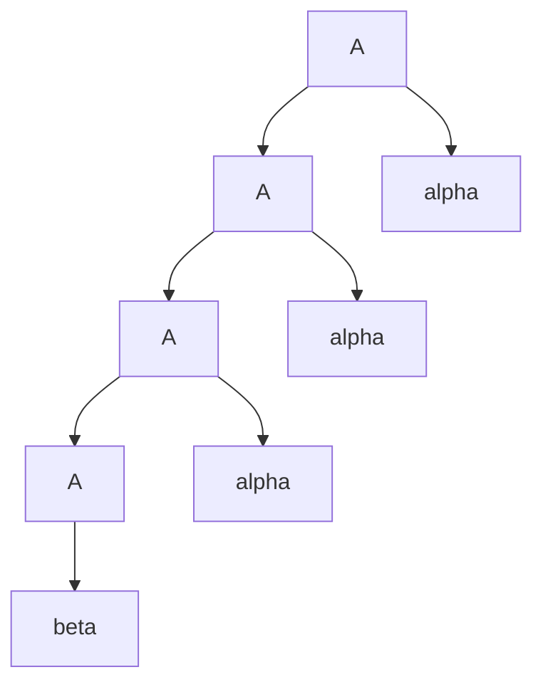
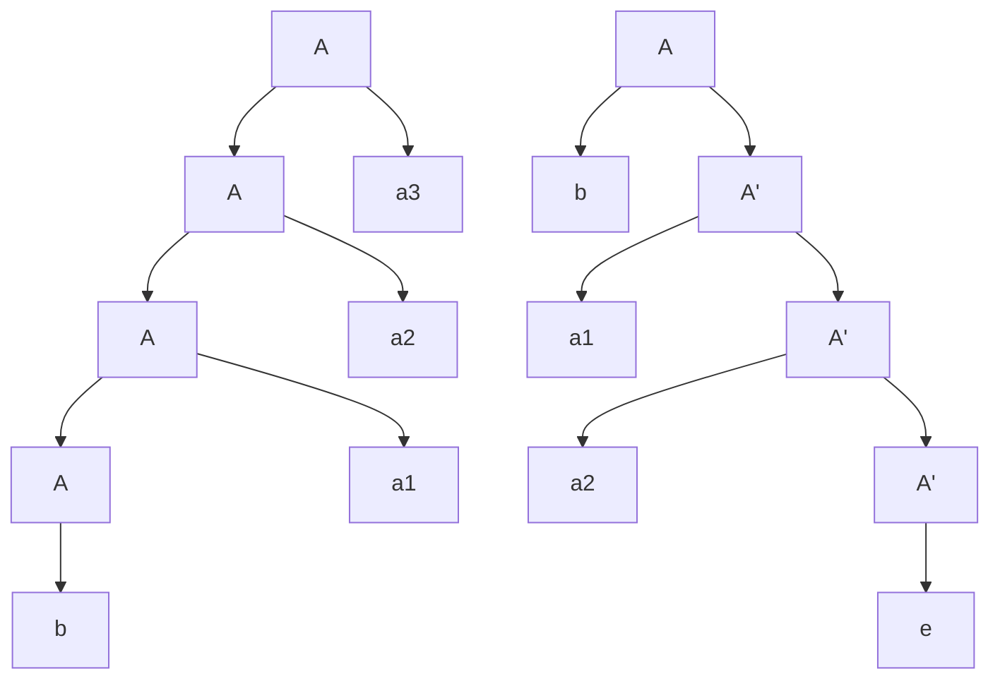
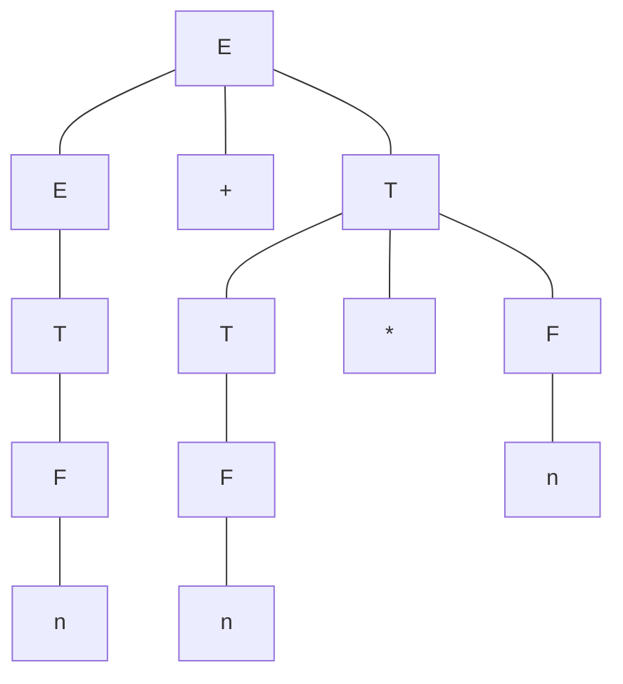
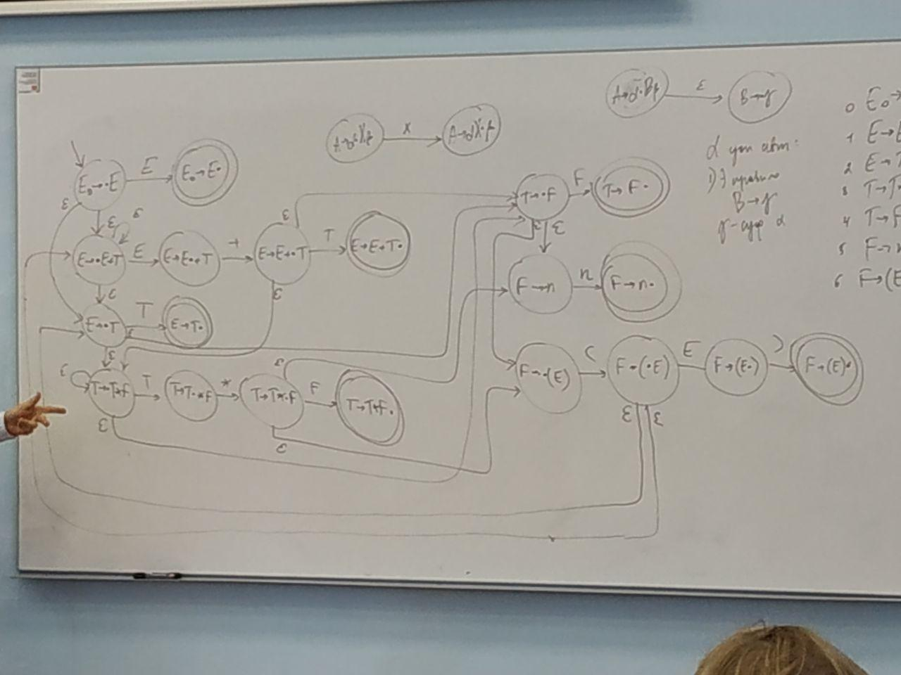
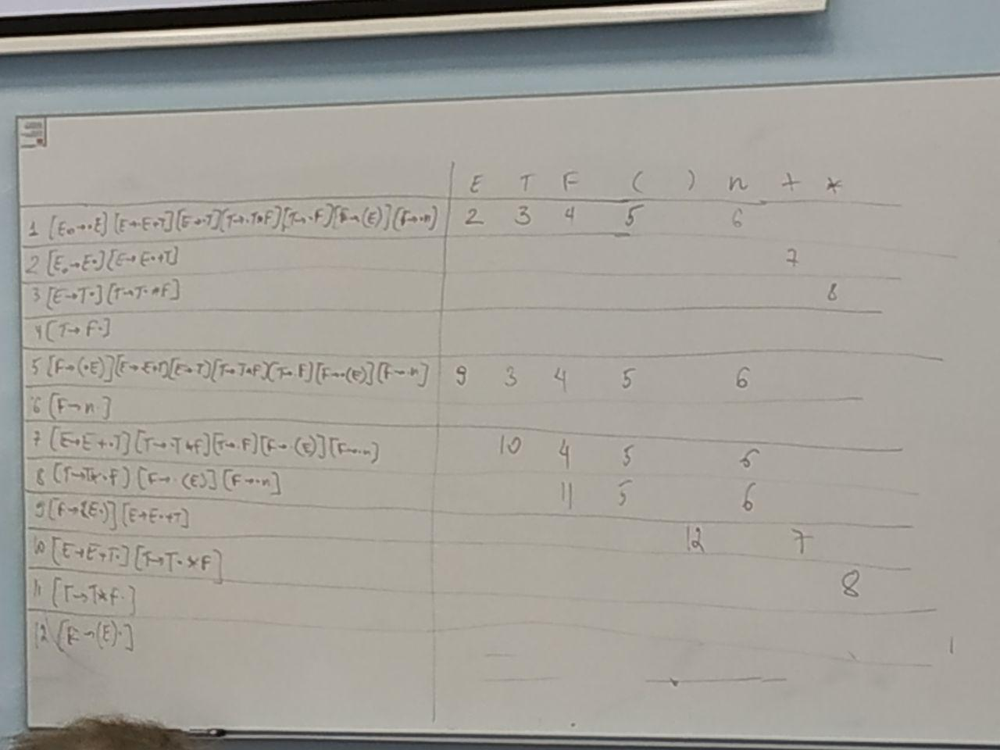
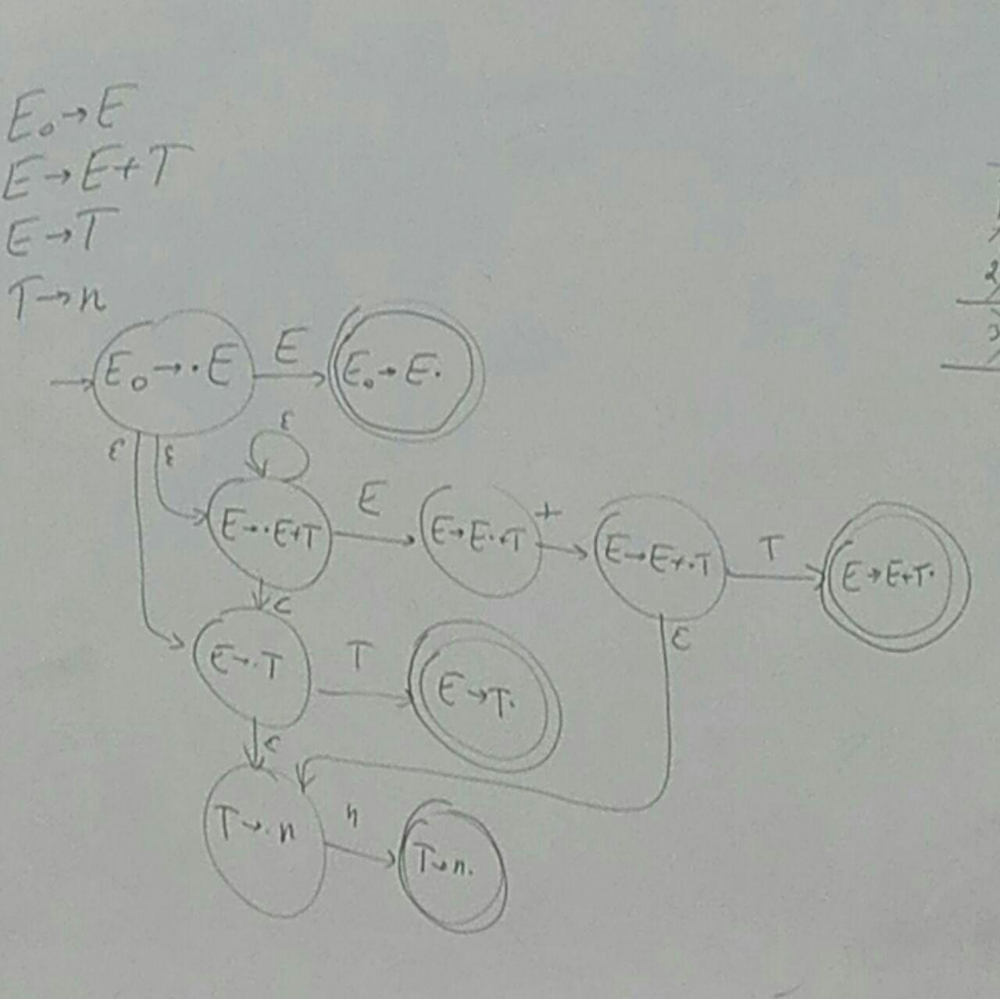
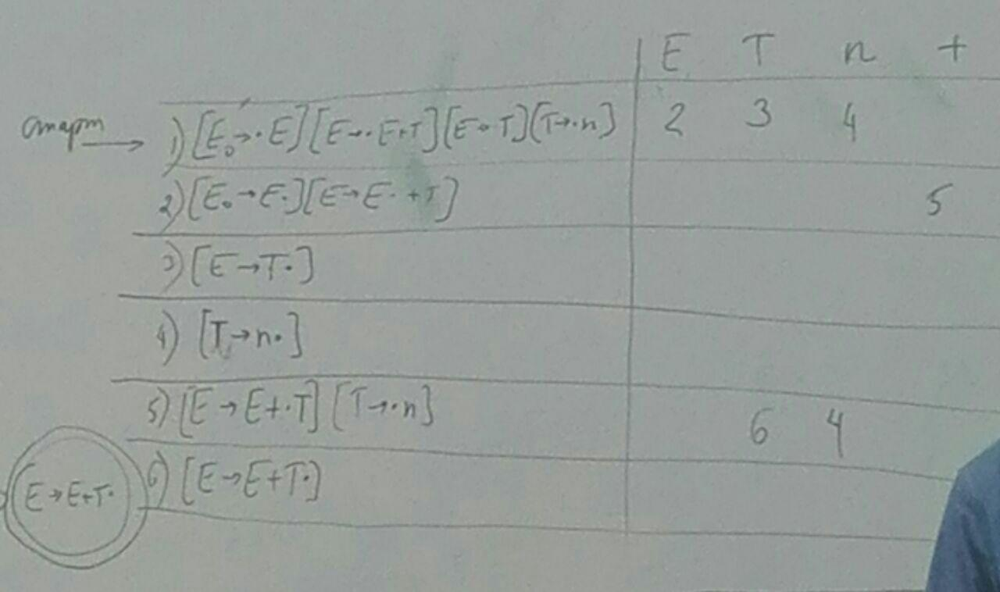
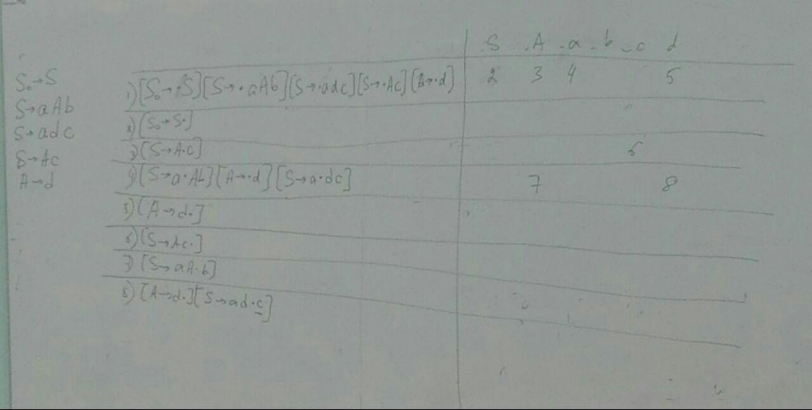

# Translation Methods

> Лабораторные:
>
> 1. Perl
> 2. Ручное построение трансляторов
> 3. Использование автоматических генераторов трансляторов
> **e.g.** ANTLR (java), Bison + Yacc (c++), Happy (haskell)
> 4. Написание автоматического генератора транслятора

$\Sigma, \Sigma^*, L \subset \Sigma^*$ - формальный язык

Базовый класс формальных языков - регулярные (= автоматные). Для порождения - регулярные выражeния, для распознавания - конечные автоматы

Контекстно-свободные языки: КС-грамматики / МП-автоматы (магазинная память)

**Токены (лексемы)** - единые неделимые элементы языка ($\in \Sigma$)

## Лексический анализ

Первый этап любого разбора - *лексический анализ*

Последовательность символов -> последовательность токенов ($\in \Sigma^*$)

>  **e.g.** арифмитические выражения
>
>  $\Sigma = \{n,+,\times,\ (,\ ) \}$
>
>  $(2 \ + \ 2) \times 2 \rightarrow  (n + n) \times n$
>
>  $n : (0|1|...|9)(0|1|...|9)^*$

*жадный лексический анализ на базе регулярных выражений*: пропускаем пробельные символы, смотрим первый непробельный, находим максимальный префикс какого-то возможного токена

---

1. Проверить, что строка выводится в грамматике $\Gamma$ // алгоритм КЯК(???) $\Omicron(n^3)$

2. Построить дерево разбора

3. Синтаксически управляемая трансляция

    >  $E \rightarrow T \\ E \rightarrow E \ + \ T \\ T \rightarrow F \\ T \rightarrow T \ \times \ F \\ F \rightarrow n \\ F \rightarrow (E)$

    **Аттрибутно-транслирующие грамматики** - контекстно-свободные языки с добавлением двух элементов: аттрибуты и транслирующие символы

    **Транслирующие символы** - фрагменты кода, которые вставляем в грамматику, которые могут взаимодействовать с аттрибутами

    >$E \rightarrow E \ + \ T \ \{E_{0}.v = E_{1}.v \ +\ T.v \}$
    >
    >$T \rightarrow T \ \times \ F \ \{T_{0}.v = T_{1}.v \ +\ F.v \}$
    >

Нужно быстрее, чем за куб $ \Rightarrow $ накладываем ограничения на грамматики

---

**Однозначность** - если у любого слова не более одного дерева разбора в этой грамматике  // Модификация алгоритма Эрли - $\Omicron(n^2)$

**LL, LR** - грамматики, на которые наложены дополнительные ограничения, чтобы разбор работал за линейное время.  **LL(R)** - **L**: left to right parse - обходим слово слева направо; **L(R)**: leftmost derivation (right most derivation) - левосторонний (правосторонний) вывод.

$\Gamma, \ w$ на вход

Можем строить дерево разбора сверзу вниз - **нисходящая трансляция**(used **LL**). Шаг называется *раскрытие нетерминала*. Нисходящий парсер : 

> 1. Находим нетерминал,у которого неизвестно поддерево
> 2. Раскрываем его
> В основном это самый левый нетерминал 

Снизу вверх - **восходящий разбор** (used **LR**). Шаг - *свёртка*

> 1. Находим правую часть какого-то терминала
> 2. Сворачиваем ее
> Получается правосторонний вывод слова (поэтому R)

## Метод нисходящих трансляций для LL грамматик

### LL(k) - грамматика

**Def:** Грамматика $\Gamma = \big \langle \Sigma, N, S, P \big \rangle$, где $\Sigma$ - множество терминалов (terms), $N$ - множество нетерминалов (nonterms), $S $ - стартовый символ ($S \in N$), $P$ - множество правил вывода (productions) $\alpha \rightarrow \beta$. Пусть $\Gamma$ - контекстно-свободная (в левой части только одиночные нетерминалы)

**Def: LL(k)-грамматика** - если достаточно посмотреть на первые k символов $\gamma$, чтобы понять, какое правило применить для нетерминала A:

**S** - стартовый нетерминал, **w** - слово, префикс которого разобран. Рассмотрим два произвольных левосторонних вывода слова **w** .

$s \Rightarrow^* xA\alpha \Rightarrow x\gamma\alpha \Rightarrow^* xy\zeta \\ s \Rightarrow^* xA\beta \Rightarrow x\xi\beta \Rightarrow^*xy\mu \\$
где $x$ и $\gamma$ - цепочки из терминалов - разобранная часть слова **w**, $A$ - нетерминал грамматики, в которой есть правила $A\rightarrow\gamma, A\rightarrow\xi$, причем $\alpha,\beta,\xi,\gamma,\mu,\zeta$ - последовательности из терминалов и нетерминалов. Если из выполнения условий, что ($|y| = k$) или ($|y| < k, \mu = \zeta =\epsilon $) , следует равенство $\gamma = \xi$, то $\Gamma$ называется  **LL(k)-грамматикой**

Грамматика $\Gamma$ называется **LL(1) грамматикой** (посмотрев на первый символ можно понять какое следующее правило нужно применить), если $s \Rightarrow^* xA\alpha \Rightarrow x\gamma\alpha \Rightarrow^* xc\zeta \\ s \Rightarrow^* xA\beta \Rightarrow x\xi\beta \Rightarrow^*xc\mu \\$
Неформально это означает, что, посмотрев на очередной символ после уже выведенной части слова, можно однозначно определить, какое правило из грамматики выбрать.

(Смотрим на символ $c$ в строке и сразу понимаем, что $\gamma = \xi$, что значит, что мы используем одно и то же правило для $A$) 

**LL(0) грамматика** - для каждого нетерминала есть только одно правило. По-другому называются "линейные программы". Такие грамматики лежат в основе теории архивации (если грамматика короче, то слово сжато, тк каждый нетерминал будет задавать только одно слово и вы можете его заменить на соответсвующий нетерминал)

---

*Example 1:* Рассмотрим грамматику и покажем, что она **LL(1)**.

$S\rightarrow aA|bB \\ A\rightarrow aB|cB\\ B\rightarrow bC|a\\C\rightarrow bD\\D\rightarrow d $

**w** = aaabd

$S\Rightarrow aA\Rightarrow aaB\Rightarrow aaaC\Rightarrow aaabD\Rightarrow aaabd\\ S\Rightarrow^*aaabd$

Каждый раз когда мы смотрели на очередной символ мы сразу определяли правило для дальнейшего вывода.

---

*Example 2:* Рассмотрим грамматику, которая  по первому символу не позволяет определить правило для дальнейшего вывода.

$S\rightarrow abB|aaA\\ B\rightarrow d\\A\rightarrow c|d$

**w** = abd

Смотрим на первый символ **w**, он подходит под несколько правил стартового нетерминала, только со второго символа понятно какое правило выбирать $\Rightarrow$ не **LL(1)-грамматика**.

---

*Example 3:* 

$E \rightarrow T \\ E \rightarrow E \ + \ T \\ T \rightarrow F \\ T \rightarrow T \ \times \ F \\ F \rightarrow n \\ F \rightarrow (E)$

Данная грамматика не является **LL(k)**. Контр-пример:
> $2*2*2*2*....+2$, где k символов до $+$

Мы не можем понять по первым k символам понять по какому нетерминалу нам применять правило.

### $FIRST$ и $FOLLOW$

---

**def** *FIRST*: $(N \cup \Sigma)^* \rightarrow 2^{\Sigma \cup \{\epsilon\}}$. По строчке из терминалов и нетерминалов возвращается множество, которое состоит из символов и $\epsilon$
$c \in FIRST(\alpha) \Leftrightarrow \alpha \Rightarrow^* cx$. Множество символов, с которых может начинаться $\alpha$
$e \in FIRST(\alpha) \Leftrightarrow \alpha\Rightarrow^* \epsilon $

> *Example* $S \rightarrow SS \\ S \rightarrow (S) \\ S \rightarrow \epsilon$
>
> $FIRST(S) = \{c, \epsilon\}$
>
> $FIRST('S)') = \{(,)\}$
>
> $FIRST(\epsilon) = \{\epsilon\}$
>
> $FIRST('))((') = \{')'\}$
> 

**def** *FOLLOW*: $N \rightarrow 2^{\Sigma \cup \{\$\}}$
	$c \in FOLLOW(A) \Leftrightarrow S \Rightarrow^* \alpha A c \beta \\
	\$ \in FOLLOW(A) \Leftrightarrow S \Rightarrow^* \alpha A$. Множество символов, которые могут быть после нетерминала

> *Example* $E \rightarrow T \\ E \rightarrow E \ + \ T \\ T \rightarrow F \\ T \rightarrow T \ \times \ F \\ F \rightarrow n \\ F \rightarrow (E)$
> 
> $FOLLOW(F) = \{),\$,+,\times\}$
> 
> $FOLLOW(E) = \{),\$,+\}$
> 

#### Лемма о рекурсивном вычислении $FIRST$

$\alpha = c\beta$
$FIRST(\alpha) = \{c\}$

$\alpha = A\beta$
$FIRST(\alpha) = (FIRST(A)) \setminus \epsilon) \cup (FIRST(\beta)\ if\ \epsilon \in FIRST(A))$

$FIRST(\epsilon) = \{\epsilon\}$

#### Алгоритм построения $FIRST$

$\forall A\ FIRST[A]=\empty$
$while\ (FIRST\ changes) \{$
  $for\ $$A\rightarrow\alpha:$
    $FIRST[A]\cup=FIRST[\alpha]$
$\}$

#### Алгоритм построения $FOLLOW$

$FOLLOW: map<N, set<$$\Sigma \cup \$>>$
$FOLLOW(S) = {\$}$
$do \{$
	$for\ A $$\rightarrow \alpha$
		$for\ B\ in\ $$\alpha$
			$let$ $\alpha = \xi B \eta$
			$FOLLOW(B) = FIRST$($\eta) \setminus \epsilon$
			$if$ $\epsilon \in FIRST(\eta)$
				$FOLLOW(B) $$\cup =$$ FOLLOW(A)$ // почему FOLLOW(A)
$\}\ while\ FOLLOW\ changes$

##### Алгоритм TODO()

1. Удалить непорождающие символы

2. Удалить недостижимые

   Менять шаги алгоритма нельзя

   **ex**: Grammar:

##### Удаление непорождающих символов TODO()

1. Множество непорождающих символов $Gen = \empty$

     do {
    ​    for A $\rightarrow \alpha$
    ​        if $\alpha \in (\Sigma \cup Gen)^*$:
    ​            Gen $\cup=$ A
    } while Gen change

    NonGen = N $\setminus$ Gen

A - порождающий, но Алгоритм 1 выбрал как порождающий
    
$A \Rightarrow \alpha \Rightarrow^{k - 1} x$

##### Алгоритм TODO()

FIRST: map<N, set<$\Sigma \cup \epsilon$>>

function getFIRST($\alpha$)

​    if $\alpha = \epsilon$ return $\{\epsilon\}$

​    if $\alpha[i] \in \Sigma$ return $\{\alpha[i]\}$

​    // $\alpha[0] \in N$

​    return $(FIRST[ \alpha[0]] \setminus \epsilon) \cup (getFIRST(\alpha[1:]), if \ \epsilon \in FIRST[\alpha[0]])$

#### Теорема 1

$\Gamma\in$  **LL(1)** $\Leftrightarrow$ $\forall A \rightarrow \alpha, A \rightarrow \beta$:

1. $FIRST(\alpha) \cap FIRST(\beta) = \empty$
2. $\epsilon \in FIRST(\alpha) \Rightarrow FIRST(\beta) \cap FOLLOW(A) = \empty$

>  Доказательство:
>  Определение **LL(1)**.
>  1. $S\Rightarrow^*xA\xi\Rightarrow^*x\gamma\xi\Rightarrow^*xc\tau$
>  2. $S\Rightarrow^*xA\eta\Rightarrow^*x\delta\eta\Rightarrow^*xc\sigma$
>  Тогда $\gamma=\delta$  
>
>  $\Rightarrow)$ (Необходимость). Пусть $\Gamma\in$ **LL(1)** 
>
>  1. $\exists A \rightarrow \alpha, A \rightarrow \beta, c \in FIRST(\alpha) \cap FIRST(\beta)$
>     $S \Rightarrow^* xA\sigma \Rightarrow x \alpha \sigma \Rightarrow^* xc\xi\sigma$
>     $S \Rightarrow^* xA\sigma \Rightarrow x \beta \sigma \Rightarrow^* xc\eta\sigma$. По символу $c$ мы не можем понять какое из правил выбирать следующим $\Rightarrow\Gamma\notin$ **LL(1)**
>  2. $\epsilon \in FIRST(\alpha) \cap FIRST(\beta)$
>     $S \Rightarrow^* xA\sigma \Rightarrow x \alpha \sigma \Rightarrow^* x\sigma \Rightarrow xc\tau$
>     $S \Rightarrow^* xA\sigma \Rightarrow x \beta \sigma \Rightarrow^* x\sigma \Rightarrow xc\tau$. По символу $c$ мы не можем понять какое из правил выбирать следующим $\Rightarrow\Gamma\notin$ **LL(1)**
>  3. $\epsilon\in FIRST(\alpha)$ и $c\in FIRST(\beta)\cap FOLLOW(A)$
>     $S\Rightarrow^*xA\xi\Rightarrow^*x\alpha\xi\Rightarrow^*x\xi\Rightarrow xc\eta$
>     $S\Rightarrow^*xA\xi\Rightarrow^*x\beta\xi\Rightarrow^*xc\beta'\xi$. Аналогино первым двум пунктам
>
>  $\Leftarrow)$ (Достаточность). Пусть $\gamma\neq\delta$. При этом выполнены условия 1 и 2:
>
>  1. Если из $\gamma$ выводится $c$ и из $\delta$ выводится $c$, то $c\in FIRST(\gamma)$ и $c\in FIRST(\delta)$, что противоречит условию 1 теоремы.
>  2. Если из $\gamma$ выводится $c$ и из $\delta$ выводится $\epsilon$, при этом $c$ лежит в $\eta$, тогда $c\in FIRST(\gamma)$, $c\in FOLLOW(A)$ и $\epsilon\in FIRST(\delta)$, что противоречит условию 2 теоремы. (аналогично для $\gamma\Rightarrow^*\epsilon\zeta$ и $\delta\Rightarrow^*c\sigma$ ).
>  3. Если из $\gamma$ выводится $\epsilon$ и из $\delta$ выводится $\epsilon$, тогда, соответственно, $\epsilon\in FIRST(\gamma)$ и $\epsilon\in FIRST(\delta)$, что противоречит 1 пункту теоремы.

## Рекурсивный спуск


#### Алгоритм

$A \rightarrow \alpha_1 | \alpha_2 | ... | \alpha_k$

1. Построить множества $FIRST$ и $FOLLOW$
2. Определим структуру $Node$

    $Node:$
      $s:$ $N \cup \Sigma$
      $ch:$ array(Node)

    $token:$ $\Sigma \cup \{\$\}$ // текущий терминал
    $next()$ // функция взятия следующего токена

3. Определим мета-фукцию $FIRST'$ (которая, на самом деле, является множеством)

    $FIRST'(A \rightarrow \alpha) = (FIRST(\alpha) \setminus \epsilon) \cup (FOLLOW(A) \ if\ \epsilon \in FIRST(\alpha))$

4. Для каждого нетерминала построим функции (строим дерево разбора). 

    ```pseudocode
    Node A() {
        Node res = Node(A)
        switch (token)
            FIRST`(A -> a1):
                // a1 = X1X2...Xl
                // X1 in N
                Node x1 = X1() // вызывается рекурсивно X1
                res.addChild(x1)
                // X1 in N
                Node x2 = X2()
                res.addChild(x2)
                // X3 in Sigma
                assert x3 = token or Error()
                res.addChild(token)
                next()

                ...
                // Xl ...
                ...

                return res
           FIRST`(A -> a2)
               ...

           default:
               Error()
    }
    ```


ETF (expression, therm, factor)

Grammar:
$$
E \rightarrow E + T \\
E \rightarrow T \\
T \rightarrow T \times F \\
T \rightarrow F \\
F \rightarrow n \\
F \rightarrow (E)
$$


|      | FIRST  | FOLLOW |
| ---- | ------ | ------ |
| E    | `n, (` | `$, +, )` |
| T    | `n, (` | `$, +, *, )` |
| F    | `n, (` | `$, +, *, )` |

$FIRST`(E + T) = {n, (}$
$FIRST`(T) = {n, (}$ замечаем, что наша грамматика не **LL(1)** (она леворекурсивная)

### Левая рекурсия и правое ветвление

---

**Определение.** $\Gamma$ называется *леворекурсивной*, если в $\Gamma: A \Rightarrow^+ A \alpha$
**Определение.** Говорят, что в грамматике есть правое ветвление, если $A\rightarrow\alpha\beta$, $A\rightarrow\alpha\gamma$ и $\beta\neq\gamma$ 

#### Теорема 2. 

$\Gamma$ - леворекурсивная или в $\Gamma$ есть правое ветвление $\Rightarrow \ \Gamma \notin LL(1) $

**Доказательство** 

1. Левая рекурсия
    $A\Rightarrow^*x,\ x\in\Sigma^*$
    $A\Rightarrow^+A\alpha$
    $A \Rightarrow^* B \xi \Rightarrow \gamma \xi \Rightarrow^* A \alpha\Rightarrow^*x\alpha=cy\alpha $
    $A \Rightarrow^* B \xi \Rightarrow \delta \xi \Rightarrow^* x = cy$
    $c \in (FIRST(\delta)) \setminus \epsilon \cup (FIRST(\xi) \ if \ \epsilon \in FIRST(\delta))$
    $c \in FIRST(\gamma) \setminus \epsilon \cup (FIRST(\xi) \ if \ \epsilon \ in FIRST(\gamma))$
   
2. Правое ветвление

    Очевидно из того, по $A\rightarrow\alpha\beta$, $A\rightarrow\alpha\gamma$ и $\beta\neq\gamma$  не выполняется пункт 1 теоремы 1 ($FIRST(\alpha\beta)\cap FIRST(\alpha\gamma)\neq\empty)$

Непосредственная левая рекурсия
$A \rightarrow A \alpha$ 
$A \rightarrow \beta$
$\beta \alpha^*$

#### Устранение левой рекурсии и правого ветвления

**Правое ветвление**
Проблема:

$A\rightarrow\alpha\beta$
$A\rightarrow\alpha\gamma$

Решение:

$A\rightarrow\alpha A`$
$A`\rightarrow\beta$
$A`\rightarrow\gamma$

**Непосредственная левая рекурсия**
Проблема: 



$A\rightarrow A\alpha$
$A\rightarrow\beta$

Решение:

$A \rightarrow \beta A`$
$A` \rightarrow \epsilon$
$A` \rightarrow \alpha A`$

**Косвенная левая рекурсия** (без $\epsilon$ правил)
Добьемся такого:

$A_1,...,A_n$
Если $A_i\Rightarrow^+A_j\alpha$, то $j>i$

$for\ i=1..n$
	$removeDescentRecursion(A_i\rightarrow A_i\alpha)$
	$for\ j=i+1..n$
		$if(exist(A_j\rightarrow A_i\beta))\{$
			$forall\ A_i\rightarrow\gamma$
            	$insert(A_j\rightarrow\gamma\beta)$
            $remove(A_j\rightarrow A_i\beta)$
            $\}$ 
Инвариант: 
Если $k<i, A_k\rightarrow\beta, \beta[1]=A_l$, тогда $l>k$
Если $k\geq i,A_k\rightarrow\beta, \beta[1]=A_l$, тогда $l\geq i$


#### Грамматика с устранённой непосредственной левой рекурсией

$$
E \rightarrow TE` \\
E` \rightarrow \epsilon \\
E` \rightarrow +TE` \\
T \rightarrow FT` \\
T` \rightarrow \epsilon \\
T` \rightarrow \times FT` \\
F \rightarrow n \\
F \rightarrow (E)
$$

|      | FIRST | FOLLOW    |
| ---- | ----- | --------- |
| E    | `( n` | `$ )`     |
| E`   | `+ e` | `$ )`     |
| T    | `( n` | `+ $ )`   |
| T`   | `* e` | `+ $ )`   |
| F    | `( n` | `* + $ )` |

```
Node E()
    Node res = Node(E)
    switch (token)
        case n, (:
            // E -> TE'
            Node t = T()
            res.addChild(t)
            Node e' = E'()
            res.addChild(e')
            return res

        default:
            Error()

Node E'()
    Node res = Node(E')
    switch (token)
       case $, ):
           // E' -> e
           return res
       case +, e:
           // E' -> +TE'
           assert token == +
           res.addChild(Node(t))
           next()
           Node t = T()
           res.addChild(t)
           Node e' = E'()
           res.addChild(e')
           return res

       default:
           Error()

    // T and T' are similar with above

Node F()
    Node res = Node(F)
    switch (token)
        case n:
            assert token == n
            res.addChild(n)
            next()
            return res
        case (:
            assert token == (
            res.addChild(\()
            next()
            Node e = E()
            res.addChild(e)
            assert token == )
            res.addChild(Node(\)))
            next()
            return res
```

#### Устранение левой рекурсии полный алгоритм (с удалением $\epsilon$ правил)

$\beta \alpha^*$
$A()$
	$switch$
		$FIRST`$($A \rightarrow \beta_1$)
			$\beta_1$
		$FIRST`$($A \rightarrow \beta_2$)
			 $\beta_2$
		...
while (token $\in$ FIRST'($A \rightarrow A \alpha $))

$A \Rightarrow^+ A\alpha$
$A \rightarrow X \alpha, \ X \in \Sigma$ или $\#X > \#A$
$A_1, A_2, ..., A_n, \ \#A_i = i$

$A_1 \rightarrow A_1 \alpha \\ A_1 \rightarrow \beta \\ A_1 \rightarrow \beta A_1' \\ A_1' \rightarrow \alpha A_1' \\ A_1' \rightarrow \epsilon $

1. Избавиться от $\epsilon$-правила

    $A_1 \rightarrow \beta A_1' \\ A_1 \rightarrow \beta  \\A_1' \rightarrow \alpha A_1' \\ A_1' \rightarrow \alpha $

2. $A_2 \rightarrow A_1 \alpha \rightsquigarrow A_2 \rightarrow \xi \alpha \ для \ всех \ A_1 \rightarrow \xi \ \ (A_2 \rightarrow A_2 \beta, A_2 \rightarrow \gamma) \\ A_2 \rightarrow A_2 \beta \\ A_2 \rightarrow \gamma$

    ```
    for i = 1..n
        for j = 1..i - 1
           A_i -> A_j alpha
           for A_j -> xi alpha
              add A_i -> xi alpha
          remove A_i -> A_j alpha
    ```

$A \rightarrow \alpha \beta$
$A \rightarrow \alpha \gamma$
$L(\alpha) \ne \{\epsilon\}$, то LL(1)

$A \rightarrow \alpha A' \\ A' \rightarrow \beta \\ A' \rightarrow \gamma$


## Построение нерекурсивных нисходящих разборов

Стек, управлящая таблица. В стеке будем хранить неразобранную часть дерева. (алгоритм ака dfs со стеком)

Напишем грамматику и занумеруем правила, построим для нее множества $FIRST$ и $FOLLOW$.

$$
E \rightarrow TE'\ (1)\\
E' \rightarrow +TE'\ (2)\\
E' \rightarrow \epsilon\ (3)\\
T \rightarrow FT'\ (4)\\
T' \rightarrow \times FT'\ (5)\\
T' \rightarrow \epsilon\ (6)\\
F \rightarrow n\ (7)\\
F \rightarrow (E) \ (8)
$$

|      | FIRST | FOLLOW    |
| ---- | ----- | --------- |
| E    | `( n` | `$ )`     |
| E'   | `+ e` | `$ )`     |
| T    | `( n` | `+ $ )`   |
| T'   | `* e` | `+ $ )`   |
| F    | `( n` | `* + $ )` |

**Управляющая таблица** нерекурсивного парсера

|         | n             | +             | *             | (             | )             | $    |
| ------- | ------------- | ------------- | ------------- | ------------- | ------------- | ---- |
| E       | 1             |               |               | 1             |               |      |
| E'      |               | 2             |               |               | 3             | 3    |
| T       | 4             |               |               | 4             |               |      |
| T'      |               | 6             | 5             |               | 6             | 6    |
| F       | 7             |               |               | 8             |               |      |
| n       | $\rightarrow$ |               |               |               |               |      |
| +       |               | $\rightarrow$ |               |               |               |      |
| *       |               |               | $\rightarrow$ |               |               |      |
| (       |               |               |               | $\rightarrow$ |               |      |
| )       |               |               |               |               | $\rightarrow$ |      |
| $\perp$ |               |               |               |               |               | $OK$ |


> пустые ячейки соответствуют ошибке

> e.g. to parse: `2 + 2 * 2`
> tree:
>
> ```mermaid
> graph TD;
>     E --> T
>     E --> E'
>     T --> F
>     T --> T'
>     F --> n
>     T' --> epsilon
>     E' --> +
>     E' --> G[T]
>     E' --> H[E']
>     G --> J[F]
>     G --> K[T']
>     J --> U[n]
>     K --> *
>     K --> O[F]
>     K --> P[T']
>     O --> L[n]
> ```

---

## Атрибутно-транслирующие грамматики (АТГ)

$N, S \in N; \Sigma; P$ - правила
Расширим определние грамматики
N & $\Sigma$ определяется в Z
**атрибуты**
$\Sigma, N$

0. имя
1. тип
2. значение (может быть не определено)
3. правило вычисления
    S-атрибуты - только присваивание атрибута

Атрибуты бывают:

1. **Синтезируемые атрибуты**
    Если его значение зависит только от поддерева, в том числе, когда этот атрибут - атрибут терминала и его значение на этапе лексического анализа
2. **Наследуемый атрибут**
    Значение зависит от родителей или братьев
    L-атрибутная

**Транслирующий символ** - специальный нетерминал, у которого единственное правило раскрыть его в $\epsilon$ и которого есть связанный с ним код, внутри которого мы можем работать с атрибутами

Могут быть **именными** и **анонимными**


> | $E \rightarrow E \ + \ T$              | \$MUL op1 = T<sub>1</sub>.v <br/>\$MUL op2 = F.v <br/>T<sub>0</sub>.v = \$MUL res |
> | -------------------------------------- | ------------------------------------------------------------ |
> | $E \rightarrow T $                     | `E.v = T.v`                                                  |
> | $T_0 \rightarrow T_1 \ \times_2 \ F_3$ | \$MUL op1 = ​T<sub>1</sub>.v <br>\$MUL op2 = F.v <br>T<sub>0</sub>.v = \$MUL​ res |
> | $T \rightarrow F$                      | `T.v = F.v`                                                  |
> | $F \rightarrow n$                      | `F.v = n.v`                                                  |
> | $ F \rightarrow (E)$                   | `F.v = E.v`                                                  |
>
> ```
> $MUL {
> res = op1 * op2
> }
> ```
>
> $$
> \$MUL
> \left\{
> 	\begin{array}{ll}
> 		op1 \ наследуемый \\
> 		op2 \ наследуемый \\
> 		res \ синтезируемый
> 	\end{array}
> \right.
> $$
>
> ```
> $ADD {
>  add = op1 + op2
> }
> ```
>
> | E    | v    |               |
> | ---- | ---- | ------------- |
> | T    | v    |               |
> | F    |      | синтезируемый |
> | n    |      | синтезируемый |
>
> ```mermaid
> graph TD;
>     E --> A[E]
>     A --> T
>     T --> F
>     F --> B[n v = 2]
>     E --> C[+]
>     E --> D[T]
>     D --> G[T]
>     G --> H[F]
>     H --> J[n v = 1]
>     D --> K[*]
>     D --> Z[F]
>     Z --> L[n v = 4]
>     D --> R[$MUL]
>     E --> W[$ADD]
> ```


>
>|$ E \rightarrow TE'$ ||E'.a = T.v <br>E.v = E'.v|
>|--|--|--|
>|$E' \rightarrow +TE' $|\$ADD E'|\$ADD​ op1 = E'<sub>0</sub>a <br>\$ADD op2 = T.v <br>E'<sub>4</sub>.a = \$ADD.res|
>|$E' \rightarrow \epsilon $||E'.v = E'.a|
>|$T \rightarrow FT' $||T'.a = E'.a <br>T.v = T'.v|
>|$T' \rightarrow \times FT' $|\$MUL T'|\$MUL op1 = T'<sub>0</sub>.a <br>\$MUL op2 = F.v <br>T'<sub>4</sub>.a = \$MUL res|
>|$T' \rightarrow \epsilon $||T'.v = T'.a|
>|$F \rightarrow n $||F.v = n.v|
>|$F \rightarrow (E)$||F.v = E.v|
>
>| E    | v                                  |
>| ---- | ---------------------------------- |
>| T    | v                                  |
>| F    | v синтезируемый                    |
>| n    | v синтезируемый                    |
>| E'   | a наследуемый <br>v синтезируемый  |
>| T'   | a наследуемый <br/>v синтезируемый |
>
>
>
>`2 + 3 * 4`
>
>```mermaid
>graph TD;
>    E --> T
>    T --> F
>    F --> n
>    T --> T'
>    T' --> e
>    E --> E'
>    E' --> +
>    E' --> A[T]
>    A --> F'
>    F' --> B[n]
>    A --> C[T']
>    C --> *
>    C --> G[F]
>    G --> L[n]
>    E' --> $ADD
>    E' --> U[E']
>    C --> $MUL
>    C --> K[T']
>    K --> Y[e]
>```


```
E'(a: int): int
    switch
        case // -> e
            return a
        case // +T $ADD E'
            skip +
            T.v = T()
            $ADD.res = $ADD(a, T.v)
            E'.v = E'($ADD.res)
            return E'.v

E(): int
   switch
       case
           T.v = T()
           E'v. = E'(T.v)
           return E'.v

$ADD(op1, op2: int): int
   return op1 + op2

// alternative:
Node E'(a)
    Node res = Node(E, atr = {a.a})

    switch
        -> e
           res v = res.a
           return res
        -> +TE'
           skip +
           T = T()
           E'4.a = res.a + T.v
           E' = E'(E'4.a)
           res.v = E'v
           return res
```


**Регистровые** машины и **Стековые** машины
операции регистровых машин: load загрузить значение и store выгрузить в память
преимущество перед регистровыми, в регистровых конечное количество регистров, здесь есть стек и операции push, pop

---

Непосредственная левая рекурсия
$A \rightarrow A \alpha$
$A \rightarrow \beta$
x - синтезируемый атрибут A

$A \rightarrow \beta A'$
$A' \rightarrow \epsilon$
$A' \rightarrow \alpha A'$



A' x - соответствует Ax - синтезируемый
a - аккумулятор - наследуемый

$A \rightarrow \beta A'$           $A' a = f(\beta)$
$A' \rightarrow \epsilon$
$A' \rightarrow \alpha A'$

A s - синтезируемый атрибут
a - наследуемый атрибут

```
A(a) -> s
    switch ()
        ...
        // A -> a
        s = f(alpha)
        // alpha_k = B
        B(<->)
```

Но вообще генерируются парсеры со стеком

## Восходящий разбор

перенос - свёртка
`shift - reduce`

Рабочий стек ($WS$) и стек предпросмотра ($PS$) (изначально вся последовательность токенов лежит в стеке предпросмотра). 
Есть две операции:

1) Перенос. Берем символ из $PS$ и переносим в $WS$.
2) Свёртка. Берем суффикс из $WS$, находим правило, для которого это правая часть. Если правил несколько, то все зависит от метода разбора.

**Пример**. Следующее дерево построено снизу-вверх.



Сразу понятно, что выбор операции (свертка или перенос) на текущем суффиксе $WS$ неочевиден, есть различные способы как это можно сделать. Первый из них - это по приоритетам операторов.

### LR - анализ

Неформальный смысл **LR(k)**. Если мы знаем строчку целиком и следующие **k** символов, то мы можем выбрать правило, по которому будем сворачивать

Отличие от **LL**. В **LL** грамматике мы знаем только первый символ того, что мы собираемся разбирать, а в **LR** грамматике мы знаем все символы того, что мы собираемся сворачивать и еще следующий. 


LR(0) редко используется, есть LR(1)
LR -> SLR (Simple LR) -> LALR -> LR(1)

$\eta B u \Rightarrow \eta \beta u = \xi A t \Rightarrow \xi \alpha t = \omega$

$\gamma = \xi t \ \ \ \ \ \ S \Rightarrow^* \gamma \ \ \ \ \ \ \ \  \xi \in (\Sigma \cup N)^*, t \in \Sigma^*$
$\alpha$ - подстрока $\gamma$
$\gamma = \xi' \alpha t'$   $\xi'$ - подстрока $\xi$, t' - суффикс t

$S \Rightarrow^* \xi'At' \Rightarrow \xi'\alpha t' = \xi t$

Ситуации (items)
LR(1) - ситуация ($A \rightarrow \alpha, K \in \{0, ..., |\alpha|\}$)




#### Теорема

Ели строка альфа допускается автоматом, построенным по этим правилам, то:

1. Существует правио $B \rightarrow \gamma$, $\gamma$ - суффикс $\alpha$



---






**def** Грамматика называется *LR0 грамматикой*, если детерминированная версия автомата по поиску основы каждое состояние содержит либо одно состояние недетерминированного автомата и ничего больше, либо содержит только нетерминальные состояния недетермнированного автомата.

*Конфликт свёртки/свёртки* ноль нетерминальных и больше одного терминала
*Конфликт переноса/свёртки*: больше нуля нетерминальных и больше нуля терминальных

Когда не работает SLR:




#### LR1

**def** *LR1-ситуация* - это тройка из правила, числа от 0 до длины правой части и символа, который называется *символом предпросмотра (look ahead)

$[A \rightarrow \alpha \bullet \beta, c]$
$[A \rightarrow \alpha \bullet d\ \beta , c] \stackrel{d}{\rightarrow} [A \rightarrow \alpha a \bullet \beta, c]$

lr1 - грамматике - если в детерминированном автомате по поиску lr1 основ

одно из них терминальное,а другое нетерминальное, то их символ предпросмотра отличается от символа перед которым находится позиция в правой части нетерминального

если они оба терминальные, то их символ предпросмотра не совпадает

[lr1 приколюхи](jsmachines.sourceforge.net/machines/lr1.html)
