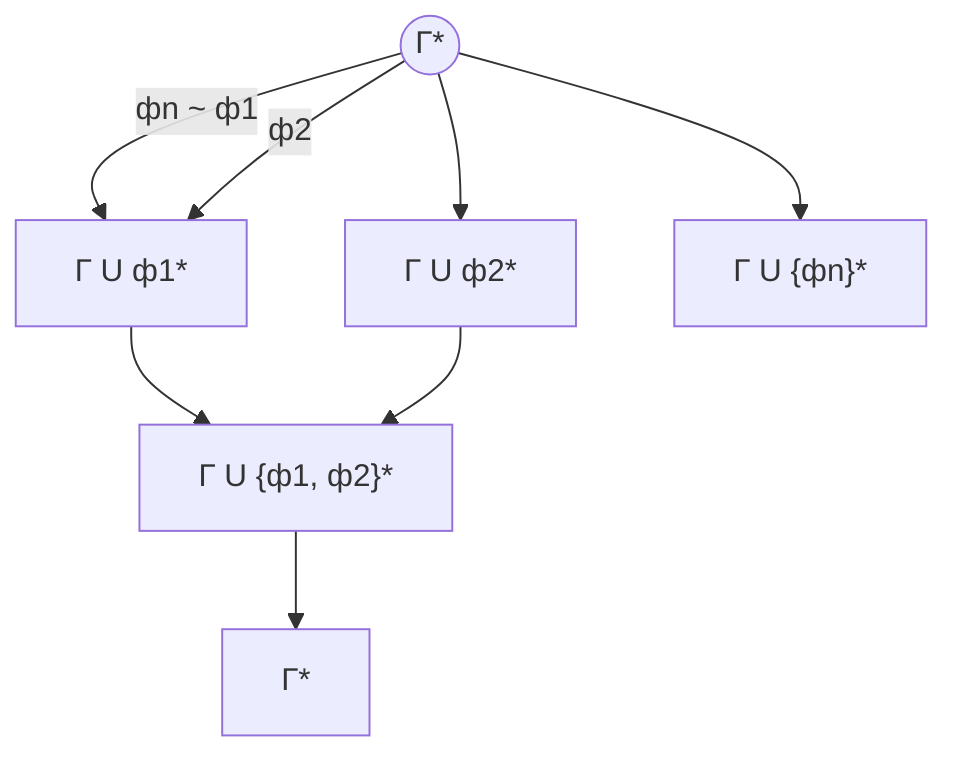

## $\lambda - calculation$

_Алонзо Чёрч_ ~ 40 годы. Развитие идеи, что все - функция

Рассмотрим алфавит

$$
pre- \lambda -term \ T \ :=
\left\{
	\begin{array}{ll}
   		x \ (variable; set \ of \ small \ letter \ with \ indices); \\
		(T,T) \ (application); \\
		\lambda x.T \ (abstraction). \\
	\end{array}
\right.
$$

x, y - метапеременные для переменных
большие буквы - метапеременные для T

Назовем два $ pre- \lambda -terms$ (P, Q)  $ \alpha$ - **эквивалентными**, если

1. P = x Q = y и x = y
2. P = (S1T1) Q = (S2T2) и S1 = $\alpha$S2, T1 = $\alpha$T2
3. P = $(\lambda x.A) \ Q \ =  \ \lambda y.B \ and \  A[x:=t] B[y:=t] \ t $ - свободная переменна

**Равенство** <=> текстовое совпадение
$$
A[x:=B] =
	\left \{
		\begin{array}{ll}
			B  , \  A=x \\
			A,  \ A=y, \ y!=x \\
			P[x:=B] \  Q[x:B] \ A = (PQ) \\
			\lambda y.p[x:=B] \ if  \ A = \lambda y.P \  and \ y \ \neq x \\
			A \ if \ A= \lambda x.P
		\end{array}
	\right.
$$
**Example**
$ (\lambda x.(\lambda y.(y x))) [x := p] \rightarrow
\lambda t.[(\lambda y.(y.x))] [x := p] \rightarrow \\
\lambda t. \lambda y((y.x)[x := p]) \rightarrow \lambda t.\lambda y.y[x := p] x[x := p] \rightarrow (\lambda t.(\lambda y.yp)) $

1. аппликация левоассоциативна: $x.y.r.t = (((x y)r)t)$
2. $\lambda$ берёт всё, что дают: $((\lambda a.(\lambda b (((((ab)c)d)e))f)g)$

$$
FV(T) =
	\left \{
		\begin{array}{ll}
			\{x\}, T = x \\
			FV(P) \cup FV(Q), T = PQ \\
			FV(P) \setminus \{x\}, T = \lambda x.P
		\end{array}
	\right.
$$

**lambda term** - класс эквивалентности lambda-term'ов по отношению эквивалентности

**def** **$\beta$-редекс**

**def** $\alpha$ ->$\beta$ B находятся в отношении $\beta $ - редукции, если

1. A = PQ B = RS. P ->$\beta$R Q =$\alpha$ S либо (знаки отрази)
2. A - B - редекс A = ($\lambda$ x.P) Q, B = p[x := Q] при условии, что Q  обобщается для подстановки для x в P

**example**
$$
\lambda a. \lambda b. a \ - И = T \\
\lambda a. \lambda b. b \ - Л = F \\
And = \lambda x. \lambda y. x \ y \ F \\
And \ T \ F = ((\lambda x. \lambda y x \ y \ F) T) F \rightarrow _\beta ((\lambda y. x \ y \ F) [x := T]) F = \\
= (\lambda y. T \ y \ F) F \rightarrow _\beta T \ F \ F = ((\lambda a. \lambda b. a) F) F) \rightarrow _\beta (\lambda b. F) F \rightarrow _\beta F
$$

### Чёрчевские нумералы

$\lambda f. \lambda x. f^n x$

$f^k (x) =
	\left \{
		\begin{array}{ll}
			x, n = 0 \\
			f(f^{n - 1}, n > 0)
		\end{array}
	\right.$

$\overline{2} = \lambda n.\lambda f. \lambda x. n \ f \ (f \ x)$

_Карринг_: a (+) b: `let plus a = fun x -> x + a`

`plus 1 3 = (plus 1) 3 = 4`

**def**  **Нормальная форма** - нет ни одного $\beta$-редексов (невозможно редуцировать)

**example:** $\omega = \lambda f . \lambda x. x. x$

$\Omega = \omega \omega$

**statement** $\Omega$ не имеет норм.

$(\lambda x. x. x) \omega = \omega. \omega$

У выражения существует нормальная форма, если существует последовательность $\rightarrow _\beta$, приводящая к нормальной форме

### Теорема Чёрча Росса

Существует не более одной нормальной формы у любого выражения

---

**def** *Транзитивное, рефлексивное и симметричное замыкание* $(\rightarrow _\beta)$ - отношение $\beta$-редуцируемости ( $\beta$-редукции)

Если для A и B существует конечная поледовательность X~n~ ... X~n~ X~1~ = A, X~n~ = B, $X_i \rightarrow_\beta X_{i + 1}$ 

То $A \rightarrow_\beta B$

**def** *Транзитивное, рефлексивное и симметричное замыкание* $(\rightarrow_\beta)$ - есть $(=_\beta)$

R-отношение $\subseteq U^2$

R обладает ромбовидным свойством, если для любых A, B, C $\in U$

1. $B \ne C$
2. $(A, B) \in R \ \ (A, C) \in R$

Существует $D \in U$:

​    $(B, D) \in R\ \ (C, D) \in R$

> $\beta$-редукция не обладает ромбовидным свойством

**def** *комбинатор* - $\lambda$-выражение без свободных переменных

$Identit \ddot{a} t = \lambda x.x$

$verSchmelrung = \lambda x. \lambda y. \lambda z. x\ z\ (y \ z)$

$Konstant = \lambda x. \lambda y. x$

$I =_\beta S\ K \ K$

## Теорема Чёрча Росса

$(\twoheadrightarrow_\beta)$ обладает ромбовидным свойством

**def** $(\stackrel{\rightarrow}{\rightarrow_\beta})$ отношение параллельной $\beta$-редукции

$A \rightrightarrows_\beta$, если 

1. $A \equiv \lambda x. P, B = \lambda x. Q, P \rightrightarrows_\beta Q$

2. $A = (\lambda x. P) Q, B = P [x = Q] $ (если есть в каждой подстановке)

3. $A = P_1 Q_1, B = P_2 Q_2$

    $P_1 = P_2 \ or\ P_1 \rightrightarrows_\beta P_2$

    $Q_1 = Q_2 \ or Q_1 \rightrightarrows_\beta Q_2$

4. $A = x, B = x, x \rightrightarrows_\beta x$

**stat** схема доказательства Чёрча Росса

1. $(\rightrightarrows_\beta)$ обладает ромбовидным свойством
2. Если R обладает ромбовидным свойстовм, то R^*^ - транзитивное замыкание обладает ромбовидным свойством
3. Из (1) и (2) следует, что $(\rightrightarrows_\beta)^*$ обладает ромбовидным свойством
4. $(\rightarrow_\beta) \subseteq (\rightrightarrows_\beta)$
5. $(\rightrightarrows_\beta)^* \subseteq (\twoheadrightarrow_\beta)$
6. $(\rightrightarrows_\beta)^* = (\twoheadrightarrow_\beta)$
7. $(\twoheadrightarrow_\beta)$ обладает ромбовидным свойством

### Следствие из теоремы Чёрча Росса

У $\lambda$-терма не может быть двух не равных нормальных форм

Пусть $A \twoheadrightarrow_\beta X, A \twoheadrightarrow_\beta Y$, причём $X \ne Y$

Тогда по ромбовидному свойству существует $T: X \twoheadrightarrow_\beta T, \ Y \twoheadrightarrow_\beta T$

Если $X = T, Y = T$, то  $ X = Y$ невозможно

Значит одно из равенств не выполняется, пусть $X \ne T$

Значит X - ненормальная форма А

**def** $(=_\beta)$ - транзитивное, рефлексивное и симметричное замыкание $(\rightarrow_\beta)$

Y - комбинатор 

Оператор неподвижной терма

$\Omega = (\lambda x. x\ x) (\lambda x. x\ x)$

$Y = \lambda f. (\lambda x. f \ (x\ x)) (\lambda x. f (x \ x))$

$x =_\beta A\ x, \ \ \ \ x = ?$

Давайте рассмотрим $x = Y A$

$YA = _\beta A (Y A)$

$YA = (\lambda f. (\lambda x. f(x \ x)) (\lambda x. f(x\ x))) A \rightarrow_\beta \\ (\lambda x. A (x \ x)) (\lambda x. A (x \ x)) \rightarrow_\beta A [(\lambda x. A(x \ x)) (\lambda x. A (x \ x))]$

$$
Fact = \lambda f. \lambda a . ((>) \ a\ 0)\\
((*)\ a\ [f\ ((-1)\ a)])\ 1\\
---\\
(Y\ Fact)\ 3 \rightarrow Fact\ (Y \ Fact) \ 3 \rightarrow_\beta \\
(*)\ 3\ ((Y \ Fact) \ 2) \rightarrow (*) \ 3\ [(*) \ 2\ [(*) \ 1 \ [Y \ Fact \ 0]]]
$$

## Нормальный порядок редукции

**def** самый левый редекс - это редекс с минимальной редукцией его первого символа

*Нормальный порядок редукции* - редуцируете самый левый редекс

### Теорема

Если нормальная форма существует, то она может быть получена п. л. (??)

---

Введём импликацию: $\supset$, аксиомы:

+ $(A \supset (A \supset B)) \supset (A \supset B)$
+ $(A \supset A)$
+ $A = _\beta B \implies A \supset B \ \& \ B \supset A$

Теория противоречива, если $\vdash \alpha$
$\Phi_A : \Phi_A =_\beta \Phi_A \supset A$
$$
\Phi_A = _\beta \Phi_A \supset A \\
\Phi_A \supset (\Phi_A \supset A) \\
(\Phi_A \supset (\Phi_A \supset A)) \supset (\Phi_A \supset A) \\
\Phi_A \supset A
(\Phi_A \supset A) =_\beta \Phi_A
$$
$\Phi_A = Y (\lambda x. x \supset A) = _\beta (\lambda x .x \supset A) [Y(\lambda x. x \supset A)] = [Y(\lambda x . x \supset A)] \supset A$
$$
X = \{a \ |\ a \notin a \} \\
\empty - 0\  type \\
\{\empty\} - 1 \ type \\
\{\{\empty\}\} - 2 \ type \\
\{\{\empty\}, \empty\} = \overline{2} \\
a \notin a \\
n \ n + 1
$$

$T :: = T_\lambda \  | \ T \rightarrow T$
$T_\lambda = \{\alpha, \beta, \gamma\}$ - множество элементарных (атомарных) типов
$\Lambda$-выражение A имеет тип $\tau$ в контексте $\Gamma$
$\Gamma \vdash A : \tau$
$\Gamma = \{x_1 : \tau_1; x_2 : \tau_2; ...; x_n : \tau_n\}$
если:

1. $\overline{\Gamma, x : \tau \vdash x : \tau}$    x не входит в $\Gamma$ (*аксиома*)
2. $\dfrac{\Gamma, x \ : \ \tau\  \vdash A \ : \ \sigma}{\Gamma\  \vdash \ \lambda \ x \ .\  A :\  \tau\  \rightarrow\  \sigma}$    x не входит в $\Gamma$ (*введение имплации*)
3. $\dfrac{\Gamma \ \vdash \ A \ : \ \tau \ \rightarrow \ \sigma \ \ \Gamma \ \vdash \ B \ : \ \tau}{\Gamma \ \vdash \ (A \ B) \ : \ \sigma}$ (*удаление импликации*)

## Просто-типизированное $\lambda$-исчисление (по Карри)

Импликационный фрагмент ИИВ

Термы:

1. $\alpha, \beta, \gamma$ (переменные)
2. $(\tau \rightarrow \sigma)$ 

A. Гильбертовский вид:

1. $\alpha \rightarrow \beta \rightarrow \alpha$
2. $(\alpha \rightarrow \beta) \rightarrow (\alpha \rightarrow \beta \rightarrow \gamma)$
3. M.P. $\dfrac{\alpha \ \ \alpha \rightarrow \beta}{\beta}$

B. Нормальный вывод:

$\dfrac{[посылка \ 1, [посылка \ 2 \ [...]]]}{заключение}$

1. Аксиома: $\overline{\tau \rightarrow \tau}$
2. Ввод импликации: $\dfrac{\sigma \ \tau}{\sigma \rightarrow \tau}$
3. Удаление импликации: $\dfrac{\sigma \ \sigma \rightarrow \tau}{\tau}$

$$
\overline{\Gamma, x : \tau \vdash x : \tau} \\
\dfrac{\Gamma, x : \sigma \vdash B : \tau}{\Gamma \vdash \lambda x. B : \sigma \rightarrow \tau} \\
\dfrac{\Gamma \vdash A : \sigma \ \ \Gamma \vdash B : \sigma \rightarrow\ \tau}{\Gamma \vdash B \ A : \tau}
$$

**Закон Пирса**: $((\alpha \rightarrow \beta) \rightarrow \alpha) \rightarrow \alpha$

0. Сохранение типа: $A \rightarrow_\beta B, \Gamma \vdash A : \alpha \implies \Gamma \vdash B : \alpha$

1. Теорема Чёрча-Россера для просто-типизированного $\lambda$-исчисленияC

    $$
    \vdash A : \alpha \\ 
    A \twoheadrightarrow_\beta B \\
    A \twoheadrightarrow_\beta C
    $$

    Тогда существует $\Gamma \vdash D : \alpha$, что $B \twoheadrightarrow_\beta D$ и $ C \twoheadrightarrow_\beta D$
    
2. **Теорема об Изоморфизме Карри-Ховарда**

    $(\implies)$ Пусть $\Gamma \vdash A : \alpha$, тогда $|\Gamma\Vdash_{ИИВ} |\alpha|$
    $|\Gamma| = |\{x_1 : \tau_1, ..., x_n : \tau_n\}| = \{|\tau_1|, ..., |\tau_n|\}$
    $|\tau|$ - отображение типа в высказывание
    
    $(\Longleftarrow)$  Пусть $\Gamma \vdash \alpha$
    Тогда найдётся $\Gamma ' : |\Gamma '| = \Gamma, |\alpha '| = \alpha'$. существует A, что $\Gamma ' \vdash A : \alpha '$
    
    > Доказательство: индукция по структуре
    
    Изоморфизм К-Х
    
    тип - высказывание
    
    терм - докозательство
    
    свободная переменная - гипотеза
    
3. О замкнутости ИФИИВ (интуиционный фрагмент ИИВ)

    Пусть $\alpha$ - формула с "$\rightarrow$" только (без &, |, !)

    Тогда $\vdash_{ИИВ} \alpha \Longleftrightarrow \  \vdash_{ИФИИВ} \alpha$

    

## Исчисление по Чёрчу

$\Lambda ::= X \ - \ variable \ |(\Lambda \ \Lambda)| \ (\lambda x^\tau . \Lambda)$,  x имеет тип $\tau$

> e.g. паскаль чуть больше, чем Чёрчу
> хаскель и окамль - типизация по Карри
>
> по Черчу - точно определяем тип 

---

$\lambda x : \sigma . A$ - альтернативный синтаксис

## Теорема: ИФИИВ замкнут относительно доказуемости

$\vdash_{ИИВ} \alpha \implies \vdash_{ИФИИВ} \alpha$

$\Leftarrow \ :\ \vdash_{ИФИИВ} \alpha \implies \vdash_{ИИВ} \alpha$ очевидно 
$\Rightarrow \ :\ \vdash_{ИИВ} \alpha \implies \vdash_{ИФИИВ} \alpha$

### Теорема: модели Крипке полны для ИИВ

$\Gamma \vdash \phi \Leftrightarrow \forall$ шкал (моделей) Крипке C $ \Vdash _C \Gamma \implies \Vdash _C \phi$

### Теорема Полнота интуционного фрагмента

$\Gamma \vdash_{ИФ} \alpha \Leftrightarrow C -$ модель  Крипке $\Vdash _C \Gamma \implies \Vdash _C \alpha$ (вынуждено)

$\Rightarrow$ очевидно

$\Leftarrow$ пусть $\Gamma \nvdash_{ИФ}  \alpha$
$W = \{\Delta \ |\  \Gamma \subseteq \Delta, \Delta$ замкнуто относительно $\vdash_{ИФ}\}$
$\{\Delta \ | \Gamma \subseteq \Delta, if \ \Delta \vdash \beta, then \ \beta \in \Delta\}$

$w_0 \leqslant w_1 \Leftrightarrow w_0 \subseteq w_1$
$w_2 \Vdash p \Leftrightarrow p \in w_2$
(p - пропозициональная переменная)

Покажем, что $w_i \Vdash \alpha \Leftrightarrow \alpha \in w_2$

По предположению теоремы $\Gamma \Vdash \alpha$ во всех моделях, в том числе и в этой, значит, $\Vdash_w \alpha$
Значит,  $\Gamma \vdash_{ИФ} \alpha$ (по определению $\Vdash$)

По предположению теоремы, $\Vdash_C \Gamma$ влечёт $\Vdash_C \alpha$  в любой C
Возьмём w в каждой C
Заметим, что $\Vdash_w \Gamma \implies \Vdash_w \alpha$ (по ф Т)
Также очевидно $\Vdash_w \Gamma$. Значит, $\Vdash_w \alpha$
Значит, $\Gamma \vdash_{ИФ} \alpha$ (по определению $\Vdash$)

1. Пусть $A : (\alpha \rightarrow \alpha) \rightarrow (\alpha \rightarrow \alpha)$    ($ = \nu$)
    $F : \nu \rightarrow \nu \rightarrow \nu$    ($\nu$ - это тип числа)

    **def** 
    $$
    E (a, b) =
    \left\{
    	\begin{array}{ll}
       		p_1, a = b = 0 \\
       		p_2(a), b = 0 \\ 
       		p_3(b), a = 0 \\
       		p_4,(a, b), a, b > 0
    	\end{array}
    \right.
    $$
    $E: \N^2 \rightarrow \N$
    $p_i(a, b)$ - полином
    $p^{k_i}(a, b) = x_1 a^{k_1}b^0 + x_2 a^{k_1 -1 }b^1 + ... + x_{k_1 + i, k_1} a^0 b^{k_1} + p^{k_1 -1}(a, b) = \sum_{0 \leqslant i, j < k } y_{i j} a^i b^j$
    $p^0(a, b) = x_0$

    **def** f(a, b) - полином от a и b, если существует k, существует $\{y_{i j}\}_{0 \leqslant i, j < k}$, что $f(a, b) = \sum_{0 \leqslant i, j,< k} y_{i j} a^i b^j$
Тогда существует E(a, b): для любых a и b: $F \overline a \overline b =_\beta \overline{E(a, b)}$ (результат функции $\beta$- эвивалентен)
    

## Теорма $\lambda_\rightarrow$ сильно нормализуемо

Любой терм $A : \alpha$ сильно нормализуем

> 3 задачи:
> 
> 
> |      | $\lambda$                                                    |                                   | логика                                                     | решение            |
> | ---- | ------------------------------------------------------------ | --------------------------------- | ---------------------------------------------------------- | ------------------ |
> | e.g. | $? \vdash ? : ?$     //   ($\vdash \lambda x . x : \alpha \rightarrow \alpha$) |                                   |                                                            |                    |
> | 1.   | $\Gamma /? \vdash ? : \alpha$                                | "Задача обитаемости типа"         | существует ли доказательство $\alpha$ в контексте $\Gamma$ | перебор деревьев   |
> | 2.   | $\Gamma / ? \vdash M : ?$                                    | "Вывод типа / реконструкция типа" | Понять, что доказываем                                     | унификация         |
> | 3.   | $\Gamma \vdash M : \alpha$                                   | "Проверка вывода"                 | дз номер 2 по мл                                           | сводится ко второй |
>
> все 3 задачи решаются в $\lambda_\rightarrow$ (экспоненциальные алгоритмы)

 В исчислении сложнее, чем лямбда-исчисление неразрешимы все 3 задачи. (ex: исчисление предикатов)